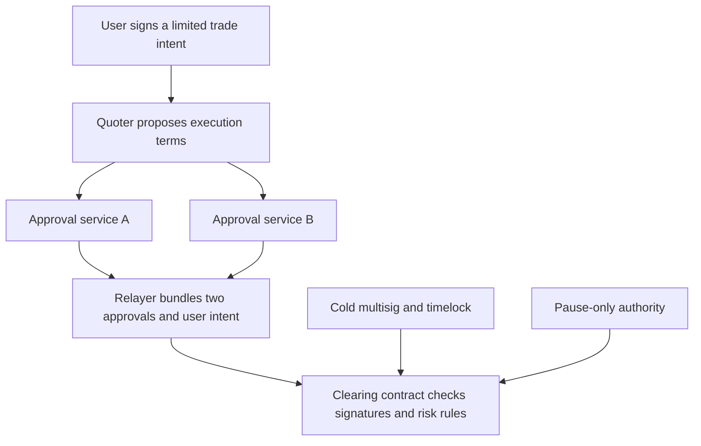

# RFQ Markets — simpler authorization and practical upgrades

2026-09-08. Design proposal for discussion; no contracts implemented, economic guarantees proved or performance benchmarks run.

Follow-up: [RFQ protocol research](RFQ-PROTOCOL-RESEARCH.md) clarifies distinct signer keys and recommends evaluating two-of-three approval for production given the user's availability requirement. Two-of-two below remains the simpler comparison case, not a settled production choice.

## Updated requirements

- Initial maker capital: approximately 1 million USDC. Hedge allocation and insurance allocation are not yet specified. Conservatively treat allocations as competing for that amount until clarified.
- Small initial position/exposure limits, with adjustable off-chain quoting and risk policy.
- Routine upgrades must preserve customer deposits and positions without withdrawal/redeposit.
- Reduce operational complexity around rotating keys while protecting against compromised quoters and hosts.
- Public developer pseudonymity and reduced origin exposure remain priorities.

Positive expected market-making returns are a business hypothesis to measure, not a solvency assumption. Measure spread/fees and funding against markouts, hedge execution/carry, liquidation gaps and operating costs. Evaluate stress paths as well as mean returns. Favorable average flow does not preclude a large clustered loss.

Maker capital does not need a promotional headline. Ordinary EVM balances and contract accounting are public, however; neither maker allocation nor insurance should be represented as secret. A raw token balance is not free capital: it includes liabilities and possibly encumbered assets. Avoid counting the same USDC as maker backing, insurance and hedge margin.

## Preferred alternative: unsigned quoters with independent approvals

The quoter proposes terms but holds no settlement authority. Two separately hosted approval services independently validate the same proposed fill and sign the same typed execution digest. The contract requires both distinct authorized signatures and the user's authorization. These are two ordinary signatures; threshold/MPC cryptography is unnecessary.

Services must derive risk state and price checks independently of the quoter. Validate the intent hash, chain/contract domain, protocol version, market, direction, quantity, price, fees, expiry, quote ID and authorization version. Check their own price reference, oracle observation policy, maker/customer exposure, pending reservations and budgets. A co-signer that accepts the quoter's assertion that a trade is safe offers little protection against a quoter bug.

Authenticate service requests and limit resource use, but treat authentication as supplementary: even a correctly authenticated compromised quoter must pass all checks. Separate credentials, deployment authority, host providers and data retrieval where practical. Independence fails if both services consume a poisoned shared price service or are replaced by the same compromised deployment credential. Avoid implementing two large pricing engines; the approval policy should be deliberately smaller and more conservative.

Every settlement must enforce current-state risk limits on-chain. Independent off-chain reservations reduce rejection rates but cannot guarantee the final ordering of concurrent settlements. Shared contract counters and atomic margin checks remain authoritative.

Both services can use stable keys in protected signer processes or a suitable hardware signer. Keys rotate for maintenance/recovery rather than on every quoter restart. Short quote deadlines and monotonically versioned authorization sets invalidate old approvals. Hardware protection can reduce key extraction but does not stop a compromised authorized process from requesting bad signatures; policy checks still matter.

Quoter replacement needs inventory/journal reconciliation but no signer registration transaction. Signer failure stops ordinary RFQ fills. Do not automatically fall back to one signature. Independent emergency-close and liquidation paths must have their own contract-defined authorization and price rules; they do not depend on these approval services.

The security improvement is specific: compromise of only one approval service cannot authorize a fill that the other rejects. This does not prevent two compromises, common software/oracle bugs, malicious upgrades, or losses on valid trades that are economically adverse.

No hourly delegation/renewal hierarchy is needed. This removes expiry-renewal races and the hot rotator that can manufacture replacement keys, but it means unattended failover of a lost approval authority is not solved automatically. Initially accept that availability tradeoff. Delayed signer additions and separately privileged immediate removal are easier to reason about than an unrestricted online recovery key.

## Alternatives and tradeoffs

| Option | Strength | Cost or limitation |
| --- | --- | --- |
| One isolated approval signer, unsigned quoters | Fewest moving parts; no quoter keys | One approval compromise can authorize adversarial fills within contract limits |
| Two independent approvals, both required | One approval compromise is insufficient | Either service outage stops RFQ execution |
| Any two of three independent approval services | Tolerates one unavailable service | More deployment/state complexity; any compromised pair suffices; every eligible pair must enforce the full policy |
| Two complementary mandatory approvals, each with redundant replicas | Distinct price/risk responsibilities can be retained | More services and careful replica/key management; not the initial simplification |
| On-chain deterministic pricing, permissionless submission | Removes discretionary maker quote authority | Changes the RFQ product; still needs robust oracle timing, impact, capital limits and MEV design |

MPC/threshold signing can hide a complete private key and reduce signatures submitted on-chain, but adds protocol and recovery complexity. It does not prove that a proposed quote is economically safe. Attested confidential computing is another defense layer, not a replacement for the contract's economic rules.

## Adjustable limits without contract upgrades

Use three layers:

1. Off-chain commercial policy: spread, skew, per-request size, hedge thresholds, venue selection and more restrictive exposure limits. Change quickly.
2. On-chain configurable limits: maximum fill, gross/net exposure, margin requirements, fee ceilings, oracle deviation/age and cumulative execution budgets. Parameter updates do not require code upgrades.
3. Code-level restrictions and governance: which roles can change parameters, maximum permitted settings, pause behavior and upgrade authority.

Permit fast reductions of new-risk capacity; raising risk ceilings requires stronger authorization and delay. Changes to maintenance on existing positions need special treatment because an apparently conservative increase can immediately liquidate users. Lowering caps below existing OI must not prevent necessary reductions. Reject fills based on post-trade exposure and formally distinguish trader reduce-only from maker risk reduction; they are not equivalent.

Counterparty and volume budgets persist across signer changes. A refill budget limits rate, not lifetime loss. Avoid claiming a fixed USDC maximum compromise loss without proving it across pricing, funding, exits, rounding, liquidations and governance changes.

## Upgrades without moving deposits

**Practical v1 candidate: a conventional upgradeable clearing system with stable proxy address/state, cold multisig authorization, timelock and a separately limited pause role.** Positions and balances remain at the same address through compatible upgrades. No user withdrawal/redeposit is required for ordinary changes.

Use standard proxy tooling and enforce initialization/storage compatibility. OpenZeppelin documents [proxy state preservation](https://docs.openzeppelin.com/upgrades-plugins/proxies) and [upgrade constraints](https://docs.openzeppelin.com/upgrades-plugins/writing-upgradeable). Storage compatibility alone does not prove economic compatibility: test funding indices, position interpretation, decimals, accrued fees and all live-state transitions. Change the signed protocol version if old intents/quotes would gain different semantics after an upgrade.

The upgrade authority is a major trust dependency. It can eventually install harmful logic. Timelocks create a review window, not permanent protection or guaranteed exit during oracle/chain/solvency failures. OpenZeppelin's [TimelockController](https://docs.openzeppelin.com/contracts/5.x/api/governance) provides delayed execution primitives. Choose the actual delay after specifying exit and incident-response behavior; do not insert an unrestricted emergency-upgrade bypass.

Do not market a separate immutable USDC vault as immutable fund protection if its upgradeable engine can set arbitrary balances, authorize arbitrary recipients or approve token spending. Such a vault preserves an address, not a meaningful trust boundary.

**Stronger alternative: immutable accounting and settlement kernel with replaceable restricted modules.** The kernel owns balances/positions and independently validates permitted transitions, signatures, oracle policy, value conservation, risk bounds and withdrawals. Modules propose actions through narrow interfaces; no delegatecall into arbitrary replacement logic and no generic transfer/approval authority. Oracle/governance dependencies also need bounded semantics.

This permits some upgrades without moving funds, but the kernel necessarily understands substantial perpetuals accounting. Replacing modules cannot fix a bug in immutable accounting or introduce arbitrary new settlement semantics. It therefore offers a smaller upgrade attack surface at the cost of more initial design work and less flexibility. A small passive vault cannot deliver those guarantees by itself.

Given the stated priority on iteration and no forced redeposits, investigate conventional delayed upgrades first and keep the immutable-kernel option for a deliberately constrained specification. This is a proposed tradeoff, not a user-approved final choice.

## Concrete next specification

Write the exact approval digest, the two approval services' rejection rules, on-chain post-trade safety checks, and the governance permission matrix. Simulate malicious proposed prices inside the oracle band, concurrent fills using the same remaining inventory, signer outage/compromise, replay after signer replacement, and upgrades against accounts with live positions.

Then choose the minimum set of on-chain risk ceilings and how much of the approximately 1 million USDC is immediately available to settle profitable accounts. Neither a positive expected return nor a signature establishes that capacity.
