# Clearing contract implementation

`contracts/RFQClearing.sol` is the first executable version of the clearing design. It is a local prototype and not an audited production contract.

## Settlement state

USDC uses six decimals, base positions use 18 decimals and rates use twelve decimals. Each account stores signed realized collateral and two positions. A position contains signed base size, average entry price and its last funding index. Keeping collateral separate from entry price means opening and withdrawal margin can ignore positive unrealized PnL while maintenance equity includes it.

The global state separately records customer collateral, maker backing and insurance. A realized customer gain debits maker backing; a realized customer loss credits it. Funding follows the same transfer rule. Fees debit the customer and credit insurance/maker according to the configured target rule. Tests require these buckets to equal actual tokens held after every tested transition, accounting for tokens paid to liquidation keepers.

## Trade path

```mermaid
flowchart LR
    R[Verified oracle report] --> F[Accrue global funding]
    F --> A[Settle account funding]
    A --> U[Verify user EIP-712 or ERC-1271]
    U --> Q[Verify two distinct approvers]
    Q --> B[Check report hash, price and fee bounds]
    B --> I[Check current inventory impact]
    I --> P[Realize PnL and update position]
    P --> M[Check account margin]
    M --> S[Check maker stress and market caps]
    S --> E[Commit events and state]
```

The transaction sender has no authority in this flow. The API gas wallet, another sponsor or the user can submit the identical signed payload. The user signature binds account, market, base delta, limit price, fee ceiling, nonce, deadline, reduce-only flag, leader epoch and policy version. The maker approval additionally binds exact execution price, impact charge, oracle report hash and signer-set version. Each displayed quote captures those versions from one pinned chain block; a later governance change fences that quote and the next quote uses the new versions. Users may cancel any unused nonce directly or through an exact EIP-712 cancellation signed for a sponsor.

An account may authorize a scoped trading session with one owner EIP-712 signature. The contract limits its markets, single-trade notional, cumulative notional, per-trade fee and expiry, capped at 30 days. A session key cannot withdraw, cancel, close through the emergency path, create another session or change authority. Revocation is currently a direct owner transaction; the local UI defaults to an eight-hour, $2,500-per-trade, $10,000-cumulative session.

The contract recomputes impact from settled aggregate BTC/ETH inventory and requires the execution price to deliver at least that signed impact relative to the directional oracle bid/ask. This closes the gap where an approval could state a safe impact charge without placing it into the actual price.

## Oracle boundary

`contracts/oracle/ChainlinkDataStreamsV3Adapter.sol` is intentionally narrow. Only the clearing contract may call it. It forwards the report to the configured Chainlink VerifierProxy, accepts only the two configured feed IDs, rejects nonpositive or inverted bid/ask values and normalizes the configured feed decimals to USDC decimals. Clearing separately checks age, expiry and width.

The adapter follows Chainlink's published v3 fields and `verifier.verify(unverifiedReport, bytes(""))` subscription-billing pattern. Production deployment must obtain and verify the current Base VerifierProxy, feed IDs, decimals and billing behavior; none are guessed in source.

## Margin, liquidation and resolution

Initial and maintenance requirements add across markets using the version 0.1 tiers. Opening and withdrawals count negative unrealized PnL but no positive unrealized PnL. A paused market still allows a margin-safe withdrawal; global resolution does not.

Liquidation values longs at bid and shorts at ask. It closes a small enough amount to target 22% equity, capped at 25% per transaction; positions at or below $10,000 or accounts with nonpositive equity close fully. The penalty is capped by positive collateral. The keeper receives the smaller of 10 bps of closed notional and 20% of the collected penalty; the remainder goes to insurance. Deficits consume insurance and then maker backing. Any remainder atomically pauses the system and starts resolution.

Resolution cannot iterate an unbounded account set in one transaction. New depositors are registered on-chain, with a $10 minimum first deposit to make dust-account expansion costly. After resolution begins, anyone may submit verified observations. The contract uses the first three monotonically timed observations for each market spanning at least 30 seconds and fixes each median. Anyone can then crystallize the account registry in bounded batches. Once complete, each account can withdraw its pro-rata entitlement. Later recoveries increase entitlements without changing claim priority, and payouts never exceed the original claim when assets are abundant.

## Upgrades and authority

The implementation follows OpenZeppelin's initializer and UUPS pattern. The implementation constructor disables initialization; the proxy initializes once. Only `governance` may authorize an upgrade, unpause, rotate approvers or replace the oracle. Production sets this address to the self-administered timelock, rather than an individual wallet. The emergency council may pause or disable a market and cannot unpause, upgrade or add authority.

Approver rotation replaces all three addresses atomically and increments both signer-set version and leader epoch. An API failover increments the epoch. Existing nonces and financial state survive either operation and the tested V2 upgrade.

Owner withdrawals can be direct or sponsored. A sponsored `WithdrawalIntent` binds the account, recipient, exact amount, nonce and deadline; the sponsor cannot redirect or increase it. Both paths settle funding, reject stale marks for open positions and preserve opening margin. When governance or the emergency council pauses trading, an owner can directly or indirectly close an entire position at the conservative verified oracle side without maker approvals. This path is unavailable while ordinary trading is live, which prevents it from bypassing RFQ inventory pricing.

Governance can withdraw maker capital only when the remaining backing stays above the configured capital target and four times the live portfolio stress loss. It cannot withdraw during resolution. The production governance address remains subject to the timelock requirement.

## Current engineering limits

The compiler uses the Solidity IR pipeline. Runtime bytecode is 23,889 bytes after adding scoped sessions and moving portfolio impact/stress calculations into the stateless linked `RFQRiskMath` library. This is below the repository's 24,000-byte gate and the EVM limit, but only 111 bytes below the project gate. The library address is fixed in each implementation's bytecode and must be verified with the implementation. Further clearing features require a deliberate module split rather than more contract growth.

The current implementation still needs an oracle path independent of the primary API for prolonged outages, a production timelock deployment and live Chainlink/Base validation. The browser prototype keeps the limited session secret in tab-scoped storage; production requires a strict content-security policy, no unreviewed third-party scripts and a provider/session design chosen after wallet testing. Its tests do not replace independent economic review, invariant fuzzing, formal accounting checks or external audits.
