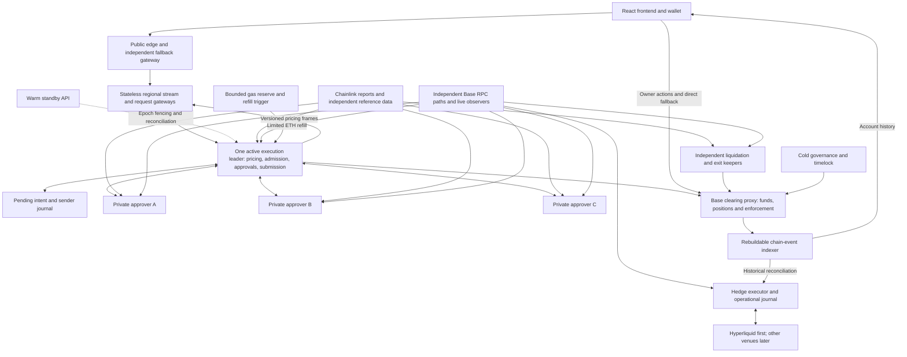

# RFQ Markets — consolidated architecture and status

2026-09-09. Canonical overview. Supersedes conflicting topology/status statements in earlier documents. Detailed requirements remain in SIMPLIFIED-DESIGN.md, ADVERSARIAL-FLOW.md and ARCHITECTURE-REVIEW.md. The full local stack is implemented and tested; no public network deployment or independent audit has occurred. The latest unbiased assessment is [SYSTEM-AUDIT-2026-09-09.md](SYSTEM-AUDIT-2026-09-09.md).

## Readiness

We have a coherent proposed system architecture, integrated threat model and complete version 0.1 economic/recovery specification, sufficient for implementation modeling and prototyping. We do not yet have a validated production design. Defenses listed below are requirements, not demonstrated protections; their equations, fixed-point implementation, failover behavior and performance still require simulation, testing and independent review.

The product is a proposed leveraged perpetual RFQ venue: on-chain USDC collateral/accounting/settlement, one operator's maker capital, off-chain prices approved by two of three operator-controlled signers, and external hedging. It is not permissionless market-making or independent-validator consensus. Governance, quoting, oracle, stablecoin, settlement-chain and hedge-venue dependencies remain explicit.

## System map

The oracle report bundle accompanies applicable settlement/keeper calls for on-chain verification. The diagram shows logical components, not one server per box.

## Elements and responsibilities

| Element | Baseline technology | Responsibility / authority |
| --- | --- | --- |
| Frontend | React, TypeScript; injected EIP-1193 wallet through ethers | Quotes, generated user limits, exact typed signatures, positions, collateral and transaction state. Never trusted accounting. |
| Public ingress | Managed edge candidate plus independent fallback | Static delivery, abuse limits and routing; cannot approve trades. Exact vendor configuration pending. |
| Public gateways | Stateless regional HTTP + SSE; optional equivalent WebSocket transport | Fan out shared pricing frames and forward one-shot firm requests; hold no settlement authority. |
| API leader + warm standby | TypeScript, Fastify | Produces pricing frames and serializes firm pricing, portfolio admission, reservations, approval collection, gas signing and broadcast. Only this writer is single-active. |
| API journal | SQLite baseline candidate for one writer; tested recovery | Pending intents, escaped approvals, reservations, sender nonces and replacements. No second customer balance ledger. |
| Approvers A/B/C | Minimal isolated services; TypeScript/viem candidate | Each independently verifies the complete deterministic policy and signs identical exact terms with its own key. |
| Clearing system | Solidity, stable upgradeable proxy; Foundry for tests | Authoritative collateral, positions, funding, settlement, margin, risk, replay and resolution rules. |
| Oracle adapter | Official Chainlink Data Streams SDK over WebSocket with REST fallback | Validates and caches exact full reports; contract verification and exact feed/schema/time/selection rules remain authoritative. Independent reference feeds only supplement approval safety. |
| Live chain observers | Independent RPC subscriptions plus reconciled reads | Fresh state for API, approvers, hedging and keepers; checkpointed disposable caches. |
| User read model | Current local SQLite event projection; production database chosen after load measurement | Rebuildable chain-derived application read model for positions and history. Live risk is computed from block-tagged contract views plus the current oracle snapshot. It never authorizes settlement. |
| Hedge executor | TypeScript/venue adapter candidate + SQLite operational journal | Actual external orders, fills and reconciled hedge exposure; separate trade authority. |
| Keepers | Independent lightweight services | Permissionless contract-defined liquidation and fallback execution; direct chain inputs. |
| Gas reserve | Capped funding mechanism plus operations trigger | Automatically supplies allowlisted gas senders under independently enforced limits. |
| Governance | Cold multisig and timelock | Upgrades, signer additions, oracle changes and risk expansion. Separate constrained emergency roles. |
| Operations | Pinned deploy artifacts, backups, external alerts and restore drills | Availability, incident response and recovery; no universal credential controlling all signers. |

Base is the proposed single settlement chain, with native USDC collateral. External hedge venues are separate execution and custody domains. No bridge or external venue balance is assumed to supply instantaneous Base withdrawal liquidity. Network contracts, SDK versions and feed availability must be pinned and verified during implementation.

## Contracts, funds and authority

Use one principal clearing proxy with internal modules/libraries rather than many independently upgradeable contracts. Logical modules: collateral ledger; positions and funding; settlement; signer/session authorization; oracle validation; margin and portfolio risk; liquidation/bankruptcy; governance hooks. Separate governance/timelock and gas-budget contracts may be appropriate.

Compatible upgrades preserve the proxy address, balances and positions. An immutable vault does not remove governance trust if upgradeable logic can invent withdrawals. No unrestricted emergency upgrade bypass. Storage layout and live financial state must both survive migration. [OpenZeppelin proxy documentation](https://docs.openzeppelin.com/upgrades-plugins/proxies).

Settlement atomically verifies user authority, exact signed terms, two distinct current approvers, leader epoch, signer/policy versions, oracle eligibility, replay state, funding accrual, current-state execution-price acceptance, account margin, maker backing and aggregate limits before committing accounting and events. Version 0.1 specifies exact-size atomic fills and fixed-point rounding direction; adding partial fills later requires cumulative nonce/fee accounting.

Customer collateral, posted maker capital, insurance and external hedge margin are distinct. Version 0.1 treats the approximately $1M as a total budget and allocates 600k Base maker backing, 150k Base insurance, 200k external hedge margin and 50k operations/treasury. If $1M is intended only for maker backing, preserve the safety ratios and fund the other categories additionally. Do not double-count or use expected profitability as backing. On-chain balances are observable whether or not marketed.

Owner-authorized deposit, withdrawal, cancellation and session revocation bypass quote approval, subject to contract risk checks. Session trading is optional and scoped by market, size/turnover, fee, expiry and withdrawal prohibition; exact limits need specification. A compromised session can still trade adversely within its scope.

## Normal execution and integrated economic defenses

The normal user-facing and generated-intent behavior is specified in [UX-AND-INTENT.md](UX-AND-INTENT.md). Users enter an amount, view the live estimate and click Buy/Sell. Protective intent fields are populated automatically; advanced settings expose slippage and related preferences.

1. Stream one shared market and portfolio-pricing frame. The browser computes the exact-size indication with shared fixed-point code; browsing and typing create no request or reservation. A firm quote is minted only after the click.
2. User signs a bounded intent: account, market, direction, size, limit, fee ceiling, deadline, nonce and relevant reduce-only/session constraints. Domain binds chain and contract.
3. The one active API atomically calculates price and reserves portfolio capacity in a short local critical section. It does not wait for remote approvals or chain settlement inside the queue.
4. Price from shared cumulative inventory cost; splitting wallets does not reset liquidity or size charges. Include fees, hedge cost and bounded inventory adjustments.
5. Treat outstanding quotes as optional executable commitments. Never assume opposing pending orders both fill or grant a favorable offset discount based on an order that can disappear. Capacity remains reserved while an escaped quote could execute.
6. Request all three approvers in parallel, collect two matching signatures, simulate and submit immediately. Each approver reads independent inputs and enforces the full policy.
7. Contracts enforce the simple current-state impact acceptance boundary and market/side/portfolio constraints even if the API hid outstanding orders. Two-of-three approvals do not supply global off-chain ordering. ECONOMIC-SPECIFICATION.md defines the version 0.1 potential, risk-reduction credit caps and test parameters.
8. Display provisional execution promptly; reconcile inclusion and reorgs through the chain-derived indexer without double counting. Refresh approval internally only under unchanged user authority; an exact accepted fill is never silently worsened.
9. Hedge reconciled exposure at the selected confirmation stage within explicit risk limits; record and reconcile external outcomes.

Correlated markets share one admission budget and factor/stress accounting, with independent gross limits. Net delta alone does not cover basis jumps or separate-account defaults. Current contract caps cannot rely on unverified external hedge state. Conservative constraints may decline a valid user request when shared capacity or price limits are exhausted; no unconditional-fill promise.

Other mandatory controls: quote-stuffing budgets; deterministic eligible oracle observations; fee/rounding resistance; bounded sponsorship; funding accrual before exposure changes; replay-safe cancellation/retry; wash-reward economics; reference-market manipulation checks; and hedge execution slippage limits. Full attack cases and simulation requirements are in [ADVERSARIAL-FLOW.md](ADVERSARIAL-FLOW.md).

## Keys, privacy and recovery

Three distinct approver keys, never copies of one secret. One unavailable signer leaves two usable; one compromised signer alone cannot satisfy the threshold. All mandatory policy checks run on each signer. Two compromised signers can authorize hostile prices within remaining contract bounds. Shared code bugs, shared provider control and shared deployment credentials can defeat nominal isolation.

Approvers expose no public application ingress. Only enrolled API identities request approval over mutually authenticated private transport or outbound connections. The API's transport identity grants connectivity, not fund control. Each approver has separately controlled provisioning, release authorization, key recovery and independent primary data paths. Stable keys avoid continual renewal; loss/compromise invokes explicit revocation/version change and cold replacement. Removal never silently reduces the threshold below two. Exposure/spend budgets survive rotation.

API holds a bounded gas key plus scoped network/oracle/RPC credentials. It has no maker, hedge, treasury or upgrade authority. The hedge host holds separately limited venue trading credentials; these can still lose venue capital. Cold governance and withdrawal authority are not on these hosts.

API failover: the existing 2-of-3 emergency council advances an expected-current leader epoch, observes sealed inclusion, reconciles old fills/commitments, then routes traffic to a pre-enrolled standby. The expected value serializes competing transitions. Old approvals become unusable after the transition; trades before it must be reconciled. Each approver durably logs before returning a signature, so two signer logs identify every potentially escaped quorum bundle. The council cannot unpause, upgrade, transfer funds or add authority. Candidate identity and private approver ingress remain operational controls, rather than a second signature protocol in the custody contract.

Hedge failover separately requires venue credential revocation or otherwise verified fencing of the old writer, followed by reconciliation. A Base epoch or database lease does not stop an old host trading on a hedge venue.

## Data, gas and availability

Base is authoritative; one rebuildable event projection is the customer read model. The executable local indexer uses SQLite and canonical block-hash reconciliation. Production may use PostgreSQL or a maintained indexing framework after dependency and load review. API intent/sender and hedge journals record different operational facts, not duplicated authoritative balances. Lost chain-derived data is rebuildable; unknown external or signed commitments require reconciliation before resuming risk. See [INDEXER-DESIGN.md](INDEXER-DESIGN.md).

Trading is sponsored by API gas wallets; ordinary automatic top-ups come from a separate allowlisted reserve under individual/global caps, maximum balances, refill rates and a finite allowance. API cannot raise those limits. Independent refill triggering has recovery gas. Treasury replenishment is periodic. UX-AND-INTENT.md specifies signed USDC deposit, lazy scoped-session certificates and relayed owner withdrawals, with direct calls as fallback; deployed-token and wallet compatibility must be tested.

Oracle observations carry identity, schema and validity metadata, but report expiry alone is not the safe trading freshness threshold. [Chainlink report schema](https://docs.chain.link/data-streams/reference/report-schema-v3). Specify maximum age, report selection, cross-market consistency and access for independent exit keepers. No arbitrary stale-price fallback or silent replacement oracle.

Run independent keeper paths for liquidation and direct fallback exits. Partial liquidation, bankruptcy, loss allocation and outage valuation are mandatory but not finalized. An oracle outage cannot be solved simply by removing approver requirements. If Base cannot include transactions, there is no immediate on-chain execution or withdrawal guarantee.

## Proposed hosting layout

Countries below retain the earlier shortlist, not verified privacy guarantees or purchased servers. VPSBG/Bulgaria, Servers.guru/Netherlands and 1984/Iceland remain provider candidates pending terms, infrastructure independence, account recovery and latency checks. Exact instance sizing and monthly cost are unset.

| Host group | Proposed placement | Workloads |
| --- | --- | --- |
| API primary / standby | Bulgaria / Netherlands | Same combined API application, separate bounded gas keys and local journals. |
| Approvers A / B / C | Bulgaria / Netherlands / Iceland | Three isolated signer hosts with separate controls; no API co-location. |
| Data primary / recovery | Bulgaria / Netherlands | Rebuildable event indexer and its database; independent keeper/monitoring processes with limited credentials. Recovery capacity can rebuild history but must meet a measured recovery target. |
| Hedge primary / standby | Bulgaria / Netherlands, separate from API/signers | Hedge execution and durable operations state; standby inactive until safely fenced takeover. |
| Independent frontend/gateway | Iceland, separate from signer | Static recovery interface and alternate ingress. |
| Public edge | Managed global service candidate | Primary frontend/ingress; independent fallback avoids sole-edge dependency. |
| Optional owned Base node | Dedicated separately sized host | Additional data independence; production RPC diversity still needed. |

The table describes security and recovery domains, not a mandatory ten-server purchase. Start with the smallest placement that preserves separate approver keys, API/hedge isolation and a warm execution recovery path; add stateless gateways and read replicas from measured traffic. Only the execution writer and its warm standby are single-active. A provider outage can still pause trading during data/hedge recovery despite an available signer quorum.

Origins are hidden from ordinary public ingress, not from providers or every network observer. Limit wallet/IP linkage, logs and retention; isolate admin access and signer deployment credentials; keep backups encrypted with separate recovery controls. Hosting country does not make public chain balances private or remove stablecoin/chain/venue dependencies.

## Open specifications and launch gates

The first complete candidate choices for these items now live in [ECONOMIC-SPECIFICATION.md](ECONOMIC-SPECIFICATION.md). They include initial capital allocation, quote equations, margin tiers, funding, oracle modes, liquidation, insolvency resolution, hedge limits, governance and recovery. They are specifications to simulate and audit, not validated production parameters. The table below therefore tracks validation work rather than missing conceptual mechanisms.

| Item | What remains |
| --- | --- |
| Financial model | Integer model and one-year hourly synthetic-book replay now run; add high-frequency shocks, venue basis/depth, stochastic order flow and parameter sweeps. |
| Economic execution | Prove production conservative pending bounds and calibrate spread/impact/expiry without subsidy loops. |
| Resolution | Local partial liquidation, loss waterfall and batched pro-rata resolution pass; add multi-account fuzzing, live-oracle tests and recovery-after-payout cases. |
| Independent exits | Verify primary/fallback feed availability, request/execute behavior and prolonged no-price handling. |
| Recovery | Signer/API WALs, signed-before-broadcast sender recovery, API restart reservation reload, canonical index rebuild and idempotent hedge recovery run locally; prove process death at every broadcast boundary, automatic fee replacement, Base reorg/RPC disagreement, leader promotion and real venue credential fencing. |
| Governance | Transparent-proxy administration and emergency restrictions exist and upgrade validation passes; deploy the timelock/multisigs and verify the ProxyAdmin owner, every selector and delay. |
| UX and deployment | Local amount/Buy/Sell ticket, injected-wallet intent signing, exact API/approver quorum and sponsored local-chain settlement run; integrate production oracle/RPC inputs, then benchmark providers, cost, tail latency and recovery objectives. |

Current executable evidence is catalogued in [VALIDATION-REPORT.md](VALIDATION-REPORT.md), and the concise local-versus-production assessment is in [LOCAL-READINESS-REVIEW.md](LOCAL-READINESS-REVIEW.md). The local API, contract-shaped approvals, scoped quick-trading sessions, restart-safe sender journal, chain-derived read model, owner-signed exit paths and mock hedge loop are connected. Portfolio risk math now sits in a stateless linked library, and quotes pin live epoch/policy/signer-set versions. The next evidence boundary is external: Chainlink Data Streams, independent Base Sepolia RPC observations, native USDC, deployed Safe/timelock roles and a Hyperliquid testnet agent wallet. Independent economic/security review and contract audits precede any bounded deployment. Production-scale pending bounds, correlated flow, compromised API/one signer, stale oracles, insolvency, reorgs, failover, gas grief and upgrades must be repeated against those real dependencies.
