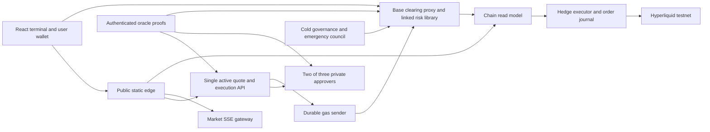

# Repository context and production readiness

Review date: 2026-09-15. Source baseline: `6c04310`, plus the pre-existing uncommitted Cloudflare runtime changes. This is an engineering readiness assessment, not an independent security audit or permission to use real capital.

## Verdict

The repository implements a substantial local clearing prototype and a connected Base Sepolia/Hyperliquid testnet profile. It does not yet implement the production deployment, operating controls, or complete economic enforcement described in its design documents. Hosting the existing image would not close those gaps.

Two milestones must remain separate:

1. A continuously hosted, recoverable public testnet with disposable capped capital.
2. A reviewed, monitored, independently administered Base mainnet canary with real capital.

The shortest path is to close custody/recovery and protocol gaps first, establish a persistent testnet runtime, collect sustained evidence, freeze an audited candidate, and then deploy a separate mainnet environment.

## Scope and evidence

Reviewed the source inventory, main contract and service implementations, shared signing/pricing code, frontend flows, simulator/calibration structure, deployment scripts, CI, historical validation reports, current checklist, and retained secret-free soak/capture summaries. Generated artifacts, dependency source, historical research documents and CSS were not treated as independently audited financial logic. Private keys and the populated environment file were not printed or copied.

Pre-existing working-tree changes: `package.json`, `package-lock.json`, `scripts/approver-process.ts`, `scripts/base-sepolia-stack.ts`; new `.dockerignore`, `Dockerfile.cloudflare`, `scripts/cloudflare-container.ts`, `scripts/prepare-cloudflare-runtime.ts`, and `deploy/cloudflare/runtime/`. Those changes belong to the existing work and were not modified during this review.

Fresh validation results are recorded below after the review run. Historical successful transactions are historical evidence, not a fresh assertion that their deployments or vendors are healthy today. Cloudflare account billing, current bindings, GitHub secrets, Access policy, vendor entitlements and current chain state require authenticated inspection before deployment.

## System and authority map

The product is an operator-backed BTC/ETH perpetual RFQ venue. Base holds USDC collateral, maker backing, insurance, positions, funding state and final settlement. The maker is the explicit counterparty to customers. External hedge margin is separate capital and is never credited as instant Base liquidity.

The direct wallet-to-contract edge exists in contract capabilities; a complete independently hosted exit application is missing.

| Boundary | Current implementation | Production implication |
| --- | --- | --- |
| Customer authority | EIP-712 intent; ERC-1271 supported for contract trades; scoped sessions | UI and API must preserve exact signed terms and support the chosen wallet matrix |
| Maker authority | Two distinct members of three configured approvers | These are operator signers, not independent consensus validators |
| API authority | Quote selection, admission, approver transport, bounded-purpose gas wallet | Gas balance bounds spending, but explicit refill/spend controls are absent |
| Clearing authority | Final accounting, margin, nonce/version checks, oracle and impact checks | Upgrade governance remains a material trust dependency |
| Governance | Timelock/Safe testnet rehearsal; disposable iteration EOA profile | New mainnet ceremony and exact role verification required |
| Emergency | Pause, expected-current epoch advance, disable/tighten market policies | No unrestricted upgrade, fund transfer or unpause authority |
| Hedge authority | Dedicated venue agent with its own journal | Venue-side fencing and capital/loss limits must be enforced separately |
| Indexer | Disposable read model plus hedge exposure endpoint | Rebuildability does not excuse incorrect checkpoints or stale exposure |

## Repository guide

### Contracts

- `contracts/RFQClearing.sol`: initialized transparent-proxy implementation. USDC deposit and EIP-3009 receipt, direct/sponsored withdrawal, nonce cancellation, owner paused close, exact-size RFQ execution, sessions, funding, liquidation, deficit absorption and batched pro-rata resolution. Storage extensions must append after `marketLimitWord`.
- `contracts/libraries/RFQRiskMath.sol`: linked stateless library for correlated quadratic impact, scenario stress, tiered margin, position transitions/PnL, liquidation sizing/charges and bounded funding updates. USDC uses 6 decimals, base size 18, funding/risk rates 12.
- `contracts/oracle/PythCoreAdapter.sol`: exact verification fee; authenticated bounded publish-time parsing; feed identity check; confidence interval becomes conservative bid/ask.
- `contracts/oracle/ChainlinkDataStreamsV3Adapter.sol`: narrow schema-v3 verifier adapter. Supported in source, but live deployment/billing is not validated by the current Pyth runtime.
- `contracts/RFQAuthorization.sol`: earlier standalone authorization/economic specimen used by its tests; it is not the customer-custody implementation.
- `contracts/testnet/RFQTimelock.sol`: governance rehearsal. Mocks, test proxy, V2 and invariant harness are fixtures, not production dependencies to deploy blindly.

Trade execution verifies the report, updates selected-market funding, settles selected-account funding, verifies customer authority and maker quorum, binds the exact report hash, checks signed price/fee and current inventory impact, updates position/capital, and enforces post-trade aggregate risk and initial margin. Reverts are atomic. Maker signatures alone cannot bypass the customer's signed bounds.

### Shared code

`packages/shared/src/eip712.ts` defines domains, hashes, wire forms and action schemas; `abi.ts` supplies service contract interfaces; `pricing.ts` implements fixed-point inventory impact and a bounded adaptive spread; `policy.ts` adds request validation; `wire.ts` serializes bigint fields; `streams.ts` decodes Chainlink envelopes; `hedge-risk.ts` defines normal/guarded/reduce-only admission.

Pricing uses the worst corner of a pending BTC/ETH exposure envelope, so optional opposing commitments do not earn an offset discount. Negative inventory impact is currently floored to zero in quotes. This is conservative and differs from richer rebate proposals in the research documents.

### Services

| Service | Responsibilities and persistent state | Main limitations |
| --- | --- | --- |
| API | Quotes, live pricing frames, account risk reads, signed actions, conditional orders; SQLite commitments, routes, orders, short fill history, sender attempts | No production bootstrap/failover orchestration; long remote work under reservation lock; incomplete durable request-result recovery |
| Approver | Private bearer-authenticated HTTP; independent block-tagged reads and secondary block-hash comparison; verifies envelope/oracle/impact/session policy; logs signature before response | Raw software keys; common parent environment; no complete policy equivalence or commitment export/recovery interface |
| Sender | Serial transaction submission; signs and records raw transactions before broadcast; same-nonce fee replacements; attempt reconciliation | Serial queue waits for receipts; single RPC; ambiguity and reverted-operation recovery need explicit terminal states and operator procedures |
| Indexer | Logs, canonical checkpoints, included/finalized account projection, public activity/positions/risk/protocol/SSE | Non-atomic checkpoint/projection writes; whole-history rebuild on reorg; confirmation depth called finalized |
| Hedger | Reconciles venue positions and client IDs, journals intent before submission, suppresses outstanding orders, computes risk mode/spread inputs | Testnet-only adapter; no venue writer fencing, aggregate loss budget or independent mainnet risk controls |
| Gateway | One upstream SSE stream, complete-frame replay, bounded reader buffers, disposable sampled chart history | Single process; no deployed regional/sharded topology, connection quotas or upstream silent-stall recovery |

`node:sqlite` is synchronous. Keep event-loop blocking, backup consistency and journal latency in the measured operating budget. Journals are financial operational evidence even though they are not customer balance ledgers.

### Applications

- `apps/web`: React market/limit ticket, local indicative pricing from common streamed frames, wallet signing, session keys held in memory, risk/positions/history, sponsored withdrawals/cancellation and API-sponsored paused close. Production builds use same-origin service paths.
- `apps/admin`: read-oriented hedge dashboard. Production expects an authenticated private proxy; setting `VITE_HEDGE_OPS_TOKEN` would embed that token in the browser bundle.
- `apps/docs`: public product guide.
- `apps/internal-docs`: operational Markdown manuals; needs real access control, not just noindex.
- `apps/design-system` and `packages/design-system`: executable visual specimen and shared tokens.

The customer UI's advertised cross-chain deposit path still signs a simulated route. There is no implemented live route adapter and no complete native-USDC wallet deposit flow in the terminal.

### Simulator and evidence scripts

The Python research model covers inventory potential, optional pending subsets, fixed-point economics, accounting, faults and market regimes. Historical hourly BTC/ETH tapes support coarse shock replay; they do not establish intrasecond execution quality. The market-flow lab normalizes Coinbase/Binance trades, buckets flow, derives causal volatility/imbalance and forward labels, purges chronological boundaries and reports untouched holdout performance. Outputs remain research-only.

The calibration formula is not identical to the deployed adaptive spread: live code uses per-component caps, rounding, hedge-mode/latency additions and uncertainty, while calibration uses a simpler weighted sum and overall cap. A candidate cannot be promoted directly without exact live-formula replay and parity tests.

`scripts/contract-e2e.mjs`, `clearing-e2e.mjs`, `risk-differential.mjs`, and `stateful-clearing-e2e.mjs` test authorization, custody, linked arithmetic and deterministic stateful trades. Service unit/injection tests and local fault scripts cover many boundaries. This is substantial deterministic evidence, but not broad invariant fuzzing or a real production failover exercise.

`scripts/local-stack.ts` launches the local mock chain profile. `scripts/base-sepolia-stack.ts` launches the connected Pyth/testnet profile and child approvers. Deploy/probe/preflight/verify/fund/bootstrap scripts are Base Sepolia specific. Upgrade and governance scripts are rehearsal tools. A clean production profile and restartable deployment manifest are absent.

### Delivery

CI runs Node 24, `npm ci` and the full local gate. Actions are pinned by commit. Static testnet deployment is separately environment-gated. It deploys terminal and public docs; it does not deploy the runtime or private sites.

The static edge routes API/indexer/market requests by service bindings and returns structured 503s if bindings are absent. `wrangler.web.jsonc` currently contains no API, INDEXER or MARKET_GATEWAY service bindings. Runtime routing uses a named single container with seven service ports.

The new image installs all npm development dependencies, the Python SDK and all services. `/data` holds all SQLite journals but has no persistent backing in checked-in configuration. A Durable Object controlling a container does not persist arbitrary files inside that container. Cloudflare explicitly documents ephemeral container disk and fresh disk after sleep/restart: [container lifecycle](https://developers.cloudflare.com/containers/concepts/architecture/).

## Prioritized findings

These severities express deployment priority. Where no adversarial reproducer was run, the finding is a code-derived risk requiring targeted validation rather than a claimed proven exploit.

### P1: Container restart loses non-rebuildable journals

Evidence: `scripts/cloudflare-container.ts:10`, `scripts/base-sepolia-stack.ts:23`, `deploy/cloudflare/runtime/worker.mjs:5` and runtime Wrangler configuration. State goes to container-local `/data`; no external journal or restore hook exists. Losing signatures, sender attempts or hedge commitments can leave ambiguous operations and make safe recovery impossible from successful chain events alone. `sleepAfter="24h"` also permits inactivity shutdown while positions remain.

Required: persistent transactional journal storage or a dedicated persistent-volume host with consistent encrypted backups; crash/redeploy/sleep recovery and deterministic chain/venue reconciliation. Do not treat R2 file copying or a periodic snapshot as equivalent to durable-before-response writes.

### P1: Current provisioning defeats approver key isolation

Evidence: runtime-secret preparation embeds the entire testnet identity bundle; `base-sepolia-stack.ts` reads all keys and spawns approvers with `env:{...process.env,...}`; the container wrapper leaves `RFQ_RUNTIME_ENV_JSON` and identity JSON in the environment. The hedge Python child also inherits the parent environment. A compromise of one child can expose the common secret bundle, including multiple signing authorities. Binding approver ports to 0.0.0.0 is another reason to verify network denial rather than infer privacy from routing tests.

Required: independently provisioned keys and release control, minimal explicit child environments, private authenticated ingress and separate production failure domains. Do not reuse any generated local/testnet identities.

### P1: Indexer checkpoints can advance past failed projection work

Evidence: `services/indexer/src/server.ts:27-41`. `syncPass()` writes headers including `to`, then logs, then account state. No transaction or staged committed cursor spans the pass. A crash or account-RPC failure after the checkpoint write makes the next pass start at `to+1`, permanently skipping missing included account/log projection work until a full rebuild. Finalized accounts can also update partially before their cursor changes.

Required: stage RPC results and atomically commit checkpoints, events and projections; only publish committed state. Inject failures at every write/read boundary and assert indexed rows equal contract reads after restart.

### P1: Bankruptcy/resolution transitions need adversarial protocol tests

Evidence: `contracts/RFQClearing.sol:304-315`, `processResolution`, `_resolutionEquity`, `_changeMaker` and `_absorbDeficit`.

- `liquidate()` lacks a `resolutionRequired` guard, while batched resolution crystallizes claims and deletes positions account by account. Liquidation can therefore mutate unresolved accounts between batches. Prove a freeze invariant or reject such mutations after the resolution trigger.
- `_changeMaker` reverts when a realized customer gain exceeds maker backing. This can block close/liquidation before the deficit path reaches `_startResolution`. Test winning accounts during aggregate maker insolvency, not only a losing-account deficit.
- Deficit absorption follows closing one selected market; a cross-margin account may still have another open position. Specify and test the account-wide bankruptcy waterfall before resetting collateral.
- Resolution valuation uses stored collateral and price PnL without a defined final funding settlement. Funding and price state can still change through permitted calls. Specify the incident cutoff and freeze final claims.

Required: targeted failing cases, invariant fuzzing across liquidation/resolution interleavings, solvency accounting and externally reviewed repairs. The existing happy-path pro-rata test does not establish these properties.

### P1: Economic enforcement differs materially from the specification

Evidence: `ECONOMIC-SPECIFICATION.md` versus `RFQClearing`, `RFQRiskMath`, approver and hedge code.

- Aggregate on-chain limits use net market exposure and six net stress scenarios. Independent long/short gross/default concentration limits described by the design are not implemented. Large opposing customer positions can cancel net exposure while retaining counterparty/default risk.
- The configured maker capital target constrains maker withdrawals but is not an explicit minimum for opening risk in `_enforceAggregateRisk`. The specified 80% maker-capital guarded mode is absent.
- All RFQ trades require post-fill initial margin, including reduce-only trades. This can reject an otherwise beneficial reduction by an account below initial margin. Tight aggregate caps also can prevent exits that reduce risk but remain above the new cap.
- Liquidation does not advance an account risk nonce or invalidate outstanding user intents as specified.
- Funding update changes only the selected market before a trade; withdrawal settles existing indices without first advancing both global indices. Seven-day catch-up can leave time unaccrued while later exposure changes alter the skew used for remaining chunks.
- Oracle disconnect fallback, stablecoin-deviation policy, richer reference-provider disagreement checks and parameter-change policy are not fully implemented.

Required: write one implementation-level economic specification, explicitly approve conservative simplifications, and test every claimed control against live code. Select capped per-side/net/gross limits and capital floors from reviewed stress evidence.

### P1: Mainnet execution and automated safety services are missing

`deploy-base-sepolia.ts` rejects chains other than 84532. Both TypeScript and Python Hyperliquid adapters explicitly reject non-testnet endpoints. No standalone production liquidation/oracle-refresh/resolution keeper, externally bounded sponsor refiller, active/passive API orchestrator, or venue-side hedge promotion/fencing service exists.

Required: separate mainnet config validation and manifests, new authorities, independently verified addresses/bytecode, production venue adapter and account constraints, keeper deployment, gas budgets and incident runbooks. Endpoint string replacement is insufficient.

### P1: Sponsored paused close omits the Pyth verification fee

Evidence: `/v1/close/execute` in `services/api/src/server.ts:336` retrieves the authenticated report and submits `closePositionWithSignature` without a transaction `value`. `PythCoreAdapter.verify()` requires `msg.value == getUpdateFee(updates)`. Unlike ordinary trade execution, this route does not query or forward the fee. Whenever the proof fee is nonzero, the sponsored emergency close reverts. Local zero-fee mock tests do not cover this live boundary.

Required: query and forward the exact fee, simulate the complete close, refresh proofs within the signed close authority, and test a paused authenticated Pyth close with a nonzero fee and the normal API path. Retain a direct owner fallback.

### P2: Approval/settlement queues undermine the latency target

Evidence: `services/api/src/server.ts:383-421` and `sender.ts:14-34`. The reservation lock spans quote refresh, remote approval calls, chain-time read and settlement simulation. `collectApprovals` awaits all three responses using `Promise.allSettled`, so an unavailable third signer can delay an already available two-signature quorum. The sender serializes through receipt waiting and replacement, making approvals expire behind earlier transactions.

Required: reserve safely before escaping commitments, release the short admission lock, finish on the first two valid current members, and bound sender queue age. Preserve pending optionality and recovery during any redesign. Benchmark concurrent real submissions and unavailable-signers at target p95/p99; local mock quote throughput is insufficient.

Approvers independently verify report/impact and declared spread arithmetic, but do not independently reconstruct rolling volatility or executed-flow toxicity. A compromised leader can understate those maker-protection components while satisfying the static floors. Resolve this documented economic trust boundary with independently replayable model inputs or approved conservative signer-side envelopes.

### P2: Recovery lacks a complete client operation lifecycle

Approver rows retain digest/signature/epoch/expiry, not complete commitment payloads or an authenticated export API. API startup restores pending exposure but not prepared quotes/results; sender reconciliation can record ambiguity while API `/health` still reports `ok:true`. Restored executing orders are relabeled open, and nonce consumption without a known trade hash can be labeled cancelled even after an executed trade.

Required: durable operation IDs, canonical result/status query, exact input binding, nonce-to-event reconciliation, explicit ambiguous/reverted/reorged states, standby journal recovery and readiness that blocks unsafe promotion. Rehearse API death after quorum, durable signing, broadcast and receipt, including HTTP response loss.

### P2: Public runtime surface and abuse controls are incomplete

The runtime worker accepts arbitrary `/v1/` paths and methods and defaults to API routing; there is no origin-authentication gate in that worker configuration. Only quote/order preparation paths receive the local quote-admission limiter. Deposit quote creation, account queries and signed sponsored actions need distinct bounded resource/gas policies. Deposit routes and terminal order entries lack complete pruning/pagination, and sender/approver tables lack retention policies. Shared proxy IPs can collapse per-client admission unless trusted proxy identity is correctly configured; that setting is not included in the current runtime-secret allowlist.

Required: exact public route/method allowlist, verified private-origin or authenticated binding-only ingress, edge quotas, cheap signature prechecks, action replay/idempotency, bounded sponsor budgets, active/terminal retention, and tested trusted-client identity.

### P2: Customer margin display credits profits against another market's loss

Evidence: `apps/web/src/TradePage.tsx:20-24`. `markAccount()` computes opening equity from `min(totalUnrealizedPnl,0)` rather than summing each position's negative PnL as the contract does. With 1,000 USDC collateral, BTC +200 and ETH -100, the UI shows opening equity 1,000 while the contract computes 900, before funding. Available margin is overstated by 100. The contract still enforces its value, so this causes misleading risk display and rejected actions rather than bypassing custody checks.

Required: shared account-risk calculation matching contract rounding, per-position negative-PnL treatment and freshness; tests with mixed winners/losers, tier boundaries and pending funding. Reject stale wallet-account responses after account changes.

### P2: Deposit and independent exit product flows are unfinished

Evidence: `/v1/deposit/quote` always returns `provider:"local-simulator"` and uses a fixed ETH conversion; execution returns 503 outside dev funding. The UI advertises "Deposit from any chain" anyway. Withdrawal/cancel/session-grant/paused-close APIs use EOA recovery although their contract equivalents support ERC-1271. Emergency close still requires API preparation, proof retrieval and sponsorship.

Required: implement a real native Base USDC flow first or disable unavailable deposit features. Cross-chain routing can be deferred behind a feature flag. Build a pinned independently hosted direct-contract exit/cancel/revoke/claim interface and test it with the API down. Complete the chosen injected/mobile/contract-wallet matrix and session expiration/reload UX.

### P2: Testnet evidence and supply-chain release gate are incomplete

The retained `.local-state/testnet-soak-latest.json` records one completed cycle with zero failures, about one minute overall, not 72 hours. `study-2026-09-12-c.csv.summary.json` records a completed 90,601-second capture, 91,634 Coinbase and 85,984 Binance trades, but 20 transport errors and reported sequence gaps of 305,863/555,370. It fails the no-errors/no-gaps gate; reported gaps also need validation against actual venue sequence semantics.

`base-sepolia-soak.ts` catches failures and continues; docs saying it stops at the first failed gate are stale. The runner writes aggregate lifecycle durations, not a complete retained percentile/fill/order ledger, and has no child deadline or SIGTERM completion handler. Its fixed cycle cap can finish before the requested duration in extreme settings.

Fresh npm audit: production-only tree has zero findings; full tree has five low findings through `@openzeppelin/upgrades-core -> ethereumjs-util -> ethereum-cryptography -> secp256k1 -> elliptic`, with no available automatic fix. Runtime-critical Fastify/ethers/tsx are classified as devDependencies, and the Docker image installs devDependencies, so `--omit=dev` alone is a misleading image gate. Python pins only the top-level SDK; transitive resolution and OS/image contents are not frozen/audited.

Required: audit the actual deployed image and Python tree; separate runtime/build dependencies, pin image digest/transitive inputs, retain SBOM/build provenance and immutable artifacts. Make CI manual deployment run or require the same full candidate gate, static validation and deployed smoke checks.

## Operational work absent from source/evidence

| Workstream | Required evidence before capital |
| --- | --- |
| Governance/custody | New cold authorities, approved threshold/delay, hardware-backed signer ceremony, exact owners/modules/roles and explorer/RPC verification |
| Availability | Active/passive API with distinct gas wallets, journal restore, epoch fencing, deterministic commitment reconciliation and externally tested routing |
| Oracle/RPC | Independently provisioned providers, divergence/throttle/outage tests, proof-age budgets, USDC identity/deviation and conservative-exit policy |
| Hedging | Revoked old writer, verified new writer, venue collateral/liquidation monitoring, gross position/depth/daily-loss limits and partial/unknown-fill recovery |
| Keepers | Independent refresh/liquidation/resolution liveness during API/oracle/RPC failure |
| Security edge | WAF/rate policies, private origin denial, Access allowlist, credential-safe public config/logs/bundles and tested external exit hosting |
| Observability | Durable structured logs and metrics, request IDs through service spans, alerts on quorum/age/lag/ambiguity/gas/hedge/capital, incident paging and owners |
| Recovery | Encrypted consistent backups, clean-host restores, measured RTO/RPO and reconciled chain/venue operations |
| Economics | Exact live-formula replay, real RFQ fills/markouts and hedge costs, capital/cap/fee/margin policy approval, independent economic review |
| Release | Reviewed immutable candidate, Solidity and infrastructure reviews, closed critical/high findings, sustained testnet/fault evidence and capped rollout decision |

Worker configuration enables logs but not explicit traces; add tracing where supported and configure intentional sampling. See [Cloudflare tracing configuration](https://developers.cloudflare.com/workers/observability/traces/). Fastify services currently disable request logging. No checked-in paging/metrics exporter/backup automation establishes the operating model.

## Deployment sequence with acceptance criteria

1. **Protocol and recovery corrections.** Close checkpoint atomicity, resolution/insolvency tests, funding policy, capital/gross limits, UI margin parity and safe request states. Acceptance: targeted regressions and invariant checks pass; source and economic specification agree.
2. **Persistent capped testnet.** Use persistent hosts/journals, strip shared child credentials, maintain continuous keepers/hedger, connect explicit edge bindings and private operations access. Acceptance: restart/redeploy/restore retains every escaped commitment and no second writer; browser trading and exits work at deployed URLs.
3. **Measured qualification.** Run the agreed sustained window (current checklist requests 72h) with both markets, actual venue hedges, independent RPCs and injected faults. Repair sequence/capture integrity and replay the exact live spread formula. Acceptance: retained transaction/order records, complete duration, measured rejection and p50/p95/p99, zero bound/replay violations and reconciled final exposure.
4. **Freeze and independent review.** Tag one candidate, retain compiler/build-info, storage and linked-bytecode evidence, frontend hashes, image digest/SBOM, selected economics and named reviewers. Acceptance: all required checks from a clean checkout; every critical/high finding closed; funded upgrade/rollback and incident/restore rehearsals pass.
5. **Separate mainnet deployment.** New keys/accounts/domains/provider credentials, audited chain/venue profiles and conservative funding/caps. Acceptance: two-RPC/explorer verification, private-ingress denial, all alerts/keepers/backups enabled, independent direct exits proven and incident owners signed off.
6. **Capped canary.** One or two markets, excess Base/venue capital, daily-loss stop, fixed initial limits and documented observation window. Acceptance: checklist execution-quality targets and bounded hedge losses hold before one dimension of risk is expanded.

No reliable calendar estimate is possible until independent review scope, host/key ownership and target economics are agreed. This is multiple engineering and operational workstreams, not a remaining credentials-only deployment task.

## Context maintenance

Use this review as the repository entry point alongside `README.md`, `ECONOMIC-SPECIFICATION.md`, `PRODUCTION-RELEASE-CHECKLIST.md` and the actual source. `CURRENT-ARCHITECTURE.md` calls itself canonical but still states no public deployment and references the earlier audit; newer README/deployment/evidence documents describe testnet deployments. Contract/indexer guides also contain obsolete session-storage, live-validation and API-field statements. Update status claims with dated evidence and distinguish implemented, historically demonstrated, proposed and qualified behavior.

## Fresh validation

- Environment: Node v24.11.1, npm 11.6.2; existing installed dependencies and working tree, not a clean `npm ci` checkout.
- `npm audit --omit=dev --json`: passed, zero findings.
- `npm audit --json`: five low findings, no moderate/high/critical findings; see image-classification caveat above.
- `npm test`: passed, exit code 0. All four contract suites, OpenZeppelin upgrade validation, 48 Python tests, 94 service tests, six edge tests, TypeScript checking, five application builds and static deployment invariants passed.
- Fresh compilation: RFQClearing 20,887 runtime bytes; 113 bytes below the 21,000-byte project gate. Contract tests included 13,500 linked-arithmetic comparisons and 600 deterministic stateful trades.
- Upgrade validation retains the explicit linked-library unsafe allowance; library correctness and deployment identity still require independent review. Node reports experimental SQLite; the internal-docs build reports a bundle-size warning. Neither failed the gate.
- No mainnet/testnet chain writes, venue orders, cloud resources, billing changes or deployments were performed during this review.
