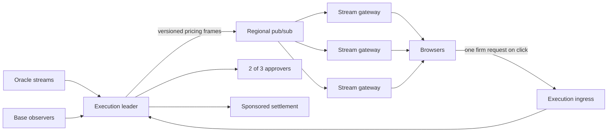

# Scale and streaming architecture

Status: production target and local implementation boundary, 2026-09-09.

## Public hot path

Watching a market must not create recurring request work on the execution leader. A browser receives one shared pricing frame over Server-Sent Events. The frame contains BTC/ETH bid, ask, timestamps, funding inputs, settled portfolio exposure and the conservative aggregate pending-exposure envelope. The browser applies the shared fixed-point pricing function to the user's exact amount. This indication creates no quote ID, reservation or server-side record.

Clicking Buy or Sell makes one `POST /v1/quote` request. The execution leader takes a coherent oracle/chain snapshot, creates a short-lived firm quote, and stores only the state required for the signed intent. The firm quote can differ from the last indication; the user's signed worst price prevents a worse fill.

SSE fits this server-to-browser flow and provides native reconnect. There is no browser polling fallback. Production may expose the same versioned schema over WebSocket for clients or networks that require it. A reconnect receives a complete frame, so missed deltas cannot corrupt client state.

## Large-concurrency topology

One active execution leader remains the serial authority for the shared maker budget and pending reservations. Public stream gateways are stateless and may all be active: they hold no gas key, signer key, reservation authority or customer ledger. They fan out the same immutable versioned frame. This preserves deterministic portfolio admission without forcing idle connections through the writer.

The local stack now implements this boundary as a separate, secret-free gateway on port 4500. It holds one upstream SSE connection to the execution API, replays the newest complete frame to reconnecting clients, performs one serialization per upstream frame, and closes slow consumers above a bounded buffer. Browsers never connect to the execution API for market streaming. Moving this process to regional gateways changes transport and capacity, not pricing or settlement semantics.

## Capacity controls

- Terminate TLS and long-lived connections at horizontally scaled gateways. Apply connection and request budgets at the edge without treating IP identity as a trading-risk control.
- Version every frame with sequence, observation time, policy version, leader epoch and source identity before production. Gateways discard regressions; clients replace state atomically.
- Coalesce source bursts to a measured maximum publish frequency. Do not manufacture price work when upstream state has not changed. Heartbeats carry no market computation.
- Keep frames bounded. The pending envelope has at most two directional totals per market; individual pending quote IDs never enter it.
- Bound slow-client buffers and reconnect with jitter. Never retain an unbounded sequence of obsolete prices.
- Rate-limit firm creation by wallet/session and edge token, while contract-wide capacity and price checks remain the Sybil-resistant protection. Browsing consumes no firm capacity.
- Put a hard global cap and expiry index on unconsumed firm quotes. The local implementation now uses a bounded expiry heap and prunes in fixed-size batches.
- Resting limit orders use per-market price heaps and a separate expiry heap. A market tick examines only orders whose raw limit crosses the current bid or ask, then runs the exact inventory-aware firm quote check. Dormant orders therefore do not create linear work per tick; cancellation and replacement use lazy deletion. The active-order ceiling remains 100,000 locally and must be calibrated against measured execution throughput.
- Measure connected streams, bytes per frame, fanout delay, dropped consumers, reconnects, firm requests per second, active commitments, admission latency, approval latency and inclusion latency separately.

## Read paths

Public chain-derived updates are event driven. The indexer publishes an invalidation after its canonical projection changes; browsers fetch a coherent bounded snapshot on that event. Account clients ignore updates that do not name their address and recompute mark-to-market, funding, equity and margin locally from the shared market frame. This avoids an RPC read for every account on every price tick.

Public risk totals are incrementally maintained for both included and finalized projections. Open-position queries use partial indexes and address-cursor pagination, so public requests do not scan or refetch every account. At production volume, identical public responses may additionally use short-lived edge caching. Personalized history is indexed by address and bounded. The indexer is rebuildable and never participates in authorization.

## Bottlenecks and correctness boundaries

Base blockspace is the settlement-throughput ceiling. Two-of-three signing, sponsor nonce sequencing and the single portfolio-admission lane must be tested against filled-trade rate, not connected viewers. Hedge health is read through a 200 ms coalescing cache for market frames, while each firm approval independently checks the protected hedge snapshot. Replicas within one signer domain may share a protected signing service and durable decision log, but remain one trust identity. Multiple execution writers are unsafe until reservations use a linearizable shared mechanism with tested failover.

SQLite is reasonable for the local writer and an early bounded deployment. It is not unlimited throughput or multi-host consensus. A replicated durable log is triggered by measured write latency, recovery time and availability needs; it must preserve durable-before-response signing and nonce ordering.

Internal chain catch-up, hedge reconciliation and oracle REST recovery may use bounded polling because they reconcile external systems and are not multiplied by browser count. Their normal path should use subscriptions, with periodic reconciliation for missed events. Public clients never poll markets or quotes.

## Production gates

The deterministic gateway harness exercises 100,000 in-memory clients, complete-frame replay, upstream reconnect and slow-reader eviction. `npm run smoke:sse-gateway` additionally exercises real HTTP connections and a 50% reconnect storm against the running stack. Before public testnet traffic, run it at the host's file-descriptor ceiling and add sustained source-burst and regional edge tests. Before mainnet, test peak filled-trade rate through firm quote, approvals, durable sender and Base inclusion, and exercise gateway loss without interrupting the leader or exposing approvers.
## Bounded chart history

The gateway samples the same normalized market frames it fans out and retains at most 1,800 observations per market in memory. `/v1/markets/history` seeds a newly opened chart without exposing upstream vendors or introducing a database. This cache is disposable presentation context: clearing and quoting never read it, and a restart may return an empty history until new frames arrive.

The private hedge dashboard consumes the hedger status SSE stream and the indexer's existing update stream. It does not poll every browser once per second. The hedger itself still performs one bounded reconciliation tick against finalized exposure; that is operational work independent of dashboard viewers.
