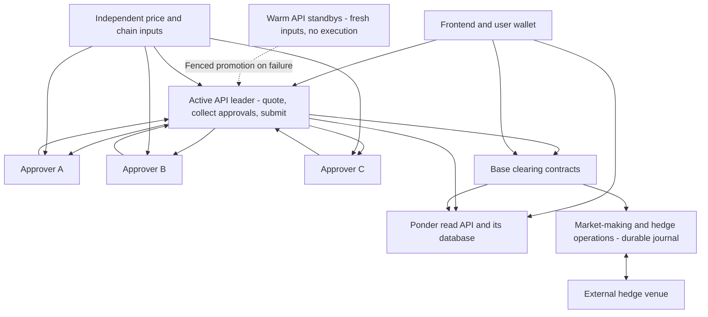

# RFQ Markets — simplified current design

2026-09-08. Current proposal, superseding the service separation and application database in SYSTEM-DESIGN.md. Confirmed topology: one active API leader, warm standbys, private approvers, and an API-held gas wallet with bounded automatic funding. No implementation or deployment has been performed.

The [security and execution-quality review](ARCHITECTURE-REVIEW.md) supplies the economic approval, safe retry, sponsorship and validation requirements incorporated here. Its discussion of multiple active API replicas is superseded: contention is managed inside one leader, with fencing/reconciliation on failover. No customer ledger or separate coordinator service is added.

## Core decision

One replaceable API application performs quoting, approval collection, bundle assembly, gas-transaction signing/broadcast and status queries. Exactly one elected leader admits trades and submits them; identical warm standbys maintain fresh inputs but do not execute. It has no authoritative customer ledger, but maintains pending-capacity and transaction-sender operational state. Nodes have distinct gas wallets rather than sharing sender nonces. Keep maker-approval signing, chain indexing and durable market-making/hedging operations outside it.

Product priorities: fast and accurate execution within user-authorized limits, low user cost, minimal avoidable rejection and wallet prompts, maximum practical security, and a small operational surface. Do not improve apparent fill rates by widening user slippage or claiming off-chain acceptance is final settlement.

The approvers and contracts assume the API is hostile. Combining API functions therefore does not remove an intended security boundary. This preserves the proposed authorization model; actual economic safety and availability still require testing.

## Replaceable API with one active leader

Merge coordinator, quoter and relayer orchestration into a TypeScript/Fastify application. Keep these as internal modules for testing, not separate deployed services. A request proposes a fill, gathers two-of-three approvals, assembles the bundle, signs with the API's gas wallet, and broadcasts through RPC.

No maker-approval key, hedge credential, treasury key or customer-database write credential lives in this application. It holds one bounded ETH gas key per node and a restricted service identity for private approver connectivity. That identity cannot sign trades or administer the approvers. Chainlink Data Streams and production RPC access may also need scoped service credentials. They confer data access, not settlement authority, and have separate quota/privacy implications. The application is not literally secret-free.

The API can cache prices and snapshots in memory. Every cache is disposable. Readiness requires sufficiently fresh verified observations, not just that the HTTP listener has started. Dynamic operator configuration comes from versioned policy; approvers independently enforce the authoritative limits. Client-provided configuration cannot override them.

Use the user intent hash as a stable identity. The browser retains the signed intent and any returned bundle and can retry against another replica. On-chain cancellation/nonces settle duplicate execution. A lost unreturned proposal can be recomputed. Status comes from chain/Ponder and the gas-signing operation's transaction record. No acknowledged irreversible off-chain fill is promised.

Only the active API proposes live executions. It serializes capacity admission and reserves capacity for its own in-flight requests, including simultaneous requests within the same process. Keep a compact recoverable in-flight journal; this is operational data, not a customer ledger. Standbys maintain current chain/market caches and recover pending intent/transaction records for takeover. Contract aggregate limits remain the final guard.

### Leader failover

A routing change alone does not invalidate an old leader's signed bundles. Proposed fencing: maker approvals bind an on-chain leader epoch in addition to the signer-set version. A leader change increments the epoch; old-epoch settlements then fail. User intents do not bind this epoch, so they can be re-approved internally after recovery within their original limits and deadline. Approver keys do not rotate with API leadership.

Use the existing approver quorum to authorize a matching promotion certificate for a pre-enrolled standby: candidate identity, expected current epoch, new epoch and expiry. The contract serializes competing promotions using the expected epoch; there is no additional omnipotent online rotator. Candidate enrollment and promotion policy require explicit specification. Approvers persist their promotion decisions, verify current chain state, and accept execution requests only from the currently active authenticated identity. Two-of-three signatures here are authorization; the chain supplies ordering, not a new off-chain consensus network.

Promotion sequence: suspect leader failure; choose a ready enrolled standby; obtain promotion authorization; submit/observe the epoch transition under the chosen confirmation policy; reconcile fills and outstanding intents; activate admission and reroute clients. A late old-leader transaction may have executed before the transition and must be accounted for. Reorgs require reconciliation. If fewer than two approvers or chain inclusion are available, no automatic promotion is guaranteed.

This adds an occasional on-chain transition, not a transaction per heartbeat or an hourly key-renewal system. Exact failure-detection timing and confirmation depth remain to be benchmarked. Prefer a brief safe recovery pause to accepting unknown overlapping exposure. Hedge-writer fencing remains separate because a Base epoch cannot invalidate external-venue credentials.

## Who can request approval?

The [adversarial order-flow requirements](ADVERSARIAL-FLOW.md) extend this design with wallet-independent cumulative pricing, conservative treatment of optional pending orders, portfolio-wide admission, and a proposed current-state contract impact bound. These are necessary because a single API leader and two signatures alone do not prevent concurrent small-order mispricing by a malicious leader. The exact economic bound remains to be specified and tested before implementation.

Approvers have no public approval endpoint or public application ingress. Only enrolled API nodes reach them through mutually authenticated private transport or outbound connections. Standbys may maintain warm connections, but only the current leader requests execution approvals. User browsers and arbitrary Internet clients cannot directly query the approvers.

Network access and economic authorization are separate checks. A compromised active API has legitimate network access, so approvers still treat its proposed terms as untrusted. Hidden ingress reduces attack exposure; it does not conceal hosts from their providers or make the active API trustworthy.

Before signing, each approver independently validates user intent/session, chain/domain, exact fill terms, fee, expiry, current leader epoch and signer-set version, price observation and its approval policy. It reads its own chain/market inputs, not only API assertions. The policy includes a deterministic economic acceptance envelope based on approved observations, size, fees and conservative inventory treatment; a broad oracle tolerance alone is insufficient. Every approver enforces the full mandatory policy. Contract safety limits remain authoritative at execution.

The endpoint authorizes a fully specified fill, not arbitrary hashes. Other callers cannot replace the user, receiver, market or quantities, or register approvers. A stolen or compromised API can censor, leak pending requests, propose bad prices or cause denial of service; it cannot bypass honest approvers or contract checks. Honest approvers can still approve trades adverse within policy, so signed does not mean profitable.

Use cheap input-size/format checks before signature recovery and expensive data reads, per-intent deduplication, bounded requests, account/sponsorship budgets and edge rate limits. A valid wallet signature alone does not solve Sybil abuse. Do not give an anonymous request unlimited paid RPC or gas access.

All three approvers retain distinct keys and the contract still requires two different authorized signer addresses. An already approved bundle may be submitted by anyone while valid; private approval generation does not require restricting the settlement transaction's sender.

## Submission with a limited gas wallet

Quote signatures authorize settlement calldata; they are not the outer EVM transaction signature. A sponsored transaction needs a sender, gas balance, nonce and signature. The API can broadcast a signed raw transaction without holding a key. See [Ethereum transactions](https://ethereum.org/developers/docs/transactions/).

The API signs the outer transaction locally with a low-balance ETH wallet. The wallet has no maker-signing, upgrade, pause, treasury or token-spending authority. It holds no user collateral and has no privileged contract role. Settlement is designed so an arbitrary sender can submit a valid bundle; correctness does not depend on the sender being our API.

Each API replica serializes its sender nonce assignment and records pending transaction hashes/replacements in a small local journal. This is operational state, not a second user dataset. Distinct gas wallets avoid a distributed nonce manager. If the journal is lost, retire/fence that sender for new submissions, reconcile on-chain intent status, and use a fresh gas wallet; old valid transactions may still land. On-chain replay protection prevents duplicate fills but does not eliminate duplicate gas costs. Simulate and apply sponsorship budgets; races can still cause reverts afterward.

A compromised gas key can transfer its ETH, waste gas and interfere with its pending transactions. Bound wallet balance and any refill allowance independently; never use an unlimited automatic top-up. A whole API compromise also exposes pending intents and data credentials and can censor or propose adverse prices. Two honest approvers and contract checks must remain sufficient to reject unauthorized settlement.

Automatically refill before low balance interrupts execution, from a separately funded gas reserve with recipient allowlisting, per-wallet/global limits, bounded refill rate and an absolute allowance. The API cannot change those limits or enroll recipients. Run monitoring/refill triggering in existing operations infrastructure and maintain an independently funded recovery trigger. Treasury replenishes the reserve periodically rather than manually topping up individual senders. Budget exhaustion alerts and safe pauses remain possible; the design does not assume infinite sponsorship.

### Low-rejection execution path

Stream indicative quotes from warm inputs. After user acceptance, reserve capacity, ask all three approvers concurrently and use the first two matching approvals. Simulate and submit immediately, without a fixed batching wait. Use direct preconfirmation/inclusion observations for prompt UI feedback; reconcile Ponder history afterward without double-counting provisional events.

User intent deadlines and maker approval lifetimes are separate. Refresh approvals or reprice within the same user's limit, fee cap, deadline and cancellation state without another wallet prompt. Reconcile ambiguous previous submissions before retrying. Never extend consent or invent a new nonce to force a second execution. Choose expiry buffers from measured tail latency; do not simply lengthen stale-price exposure. Distinguish genuine price-limit failures from avoidable operational failures in metrics.

Two maker approvals remain required even when one gas sender signs the outer transaction. Compromising only a gas key does not create maker authorization. The user can instead submit with their own wallet, which eliminates sponsorship but changes gas/payment UX. No account-abstraction/paymaster dependency is needed for this baseline.

## One source of user-facing data

Base is authoritative. Ponder is the sole application read model. The frontend queries Ponder's restricted HTTP endpoints directly, or the API proxies those queries without copying the results into another database. Account responses include indexed block/checkpoint information. Pending status is explicitly an overlay, not a second balance ledger.

Ponder still needs storage. Its [self-hosting documentation](https://ponder.sh/docs/production/self-hosting) describes PostgreSQL, and it supports [application HTTP endpoints](https://ponder.sh/docs/query/api-endpoints). Removing our extra PostgreSQL application model does not make Ponder database-free. Do not assume SQLite is a supported drop-in backend for the selected Ponder version.

Ponder owns its schema and reorg handling. No manual balance edits or synchronization jobs between application-owned customer tables. Read endpoints use pagination, query limits and no privileged writes. If Ponder lags, show that status; do not present stale history as current execution state.

Approvers and keepers still read current chain state independently. Those observations are disposable validation caches, not separately maintained customer ledgers. Contracts compute current-state balances/margin during execution.

## Internal operations storage

Keep one durable MM/hedge journal for things not recoverable from Base: hedge intent/client IDs, acknowledgements, ambiguous outcomes, venue reconciliation, markouts and strategy changes. SQLite is a candidate for a single writer with tested backups and controlled takeover; PostgreSQL is appropriate if concurrent writers/operational requirements justify it. This is deliberately different data, not another copy of the customer ledger.

Store transaction-sender nonce/replacement records locally with each API replica. No central user database is required for these records. Never automatically replay an uncertain hedge after restoring an old backup; reconcile the venue and fence the old writer first.

Hedging and keeper logic remain separate from the stateless public API because they have durable actions and/or hot credentials. Keepers can be lightweight processes on existing operations/data hosts while preserving independent observation and an outage fallback. Do not co-locate every independent keeper with one journal writer.

## Secrets and hosting implications

The API contains no maker or fund-control authority, but it contains a bounded gas key and may contain scoped oracle/RPC and transport credentials. Keep them out of the built image and inject them during provisioning. Treat their exposure according to their actual authority. This is the accepted simplification over the earlier literally-secret-free API proposal.

Keep the three private approvers across the proposed Bulgaria/Netherlands/Iceland provider boundaries. Deploy one active API plus warm standbys. Keep Ponder and its own database together; give the MM/hedge journal its own controlled storage. Separate coordinator/quoter/relayer servers and the duplicate application database are removed. A hosted node, redundant indexer and dedicated fallback machine are availability/privacy choices to assess separately, not required logical services for quote processing.

Safe simplification is merging untrusted orchestration and removing duplicate derived data. It is not merging signer identities, trusting the API's risk calculations, removing replay protection, or discarding unresolved hedge/transaction records.
