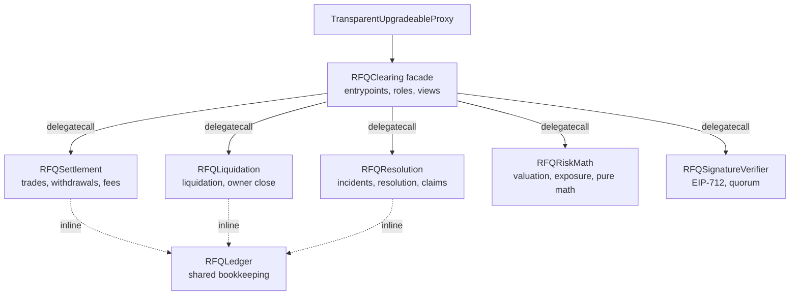

# Clearing contract implementation

`contracts/RFQClearing.sol` is the v1 clearing contract. It has not been externally audited. v1 is a fresh deployment: its storage is not compatible with the earlier Base Sepolia proxies, so those cannot be upgraded to it. Later v1 changes only append to the namespace (the per-market `costBasis` was appended after the first deployment), so a v1 proxy can be upgraded in place; a proxy that already holds open positions needs a fresh deployment instead, because its cost basis would start at zero.

## Layout

`RFQClearing` keeps the external ABI, access control and views. The heavy paths live in linked libraries that run by `DELEGATECALL` against the proxy's storage, which keeps every deployed contract under the 24,576-byte EIP-170 limit with room to grow. All state sits in one ERC-7201 namespace (`rfq.clearing.v1`, `contracts/RFQClearingStorage.sol`), so no contract in the chain declares ordinary storage variables. Shared constants, structs and errors are in `contracts/RFQTypes.sol`; every event is declared once in `contracts/interfaces/IRFQClearingEvents.sol`, which libraries emit and the facade inherits so the ABI exposes them. The build pins `evmVersion` to `cancun` for transient-storage reentrancy guards.

`npm run compile:contracts` (solc-js, used by the e2e scripts and deploy tooling) and `forge build` compile the same sources with the same settings. Both deploy scripts deploy the libraries recursively and link them before the implementation.

## Settlement state

USDC uses six decimals, base positions use 18 decimals and rates use twelve decimals. Each account stores signed realized collateral and two positions. A position contains signed base size, average entry price and its last funding index. Keeping collateral separate from entry price means opening and withdrawal margin can ignore positive unrealized PnL while maintenance equity includes it.

The global state separately records customer collateral, maker backing and insurance. A realized customer gain debits maker backing; a realized customer loss credits it. Funding follows the same transfer rule. Fees debit the customer and credit insurance/maker according to the configured target rule. Tests require these buckets to equal actual tokens held after every tested transition, accounting for tokens paid to liquidation keepers.

## Trade path

```mermaid
flowchart LR
    R[Verified oracle report] --> F[Accrue funding, settle both legs]
    F --> U[Verify user EIP-712, ERC-1271 or session key]
    U --> Q[Verify two distinct approvers and fencing versions]
    Q --> B[Check report hash, limit price and fee ceiling]
    B --> I[Check trade/session limits and inventory impact]
    I --> S[Check capital floor, gross/side/net caps and stress]
    S --> P[Realize PnL, update position, charge fee]
    P --> M[Check margin: initial to add risk, maintenance to reduce]
```

Exposure admission (`RFQRiskMath.checkExposureTrade`) values gross and per-side books at the ask and net skew and the six stress scenarios at mid. A trade that adds risk needs an enabled market, maker backing (after the trade's realized PnL) of at least `baseRiskCapitalTarget`, every cap satisfied and stress loss at most a quarter of backing. A reduction may run on a disabled market or above a tightened cap as long as it does not make any of those metrics worse. Any market with open positions must have a price no older than 15 seconds.

The transaction sender has no authority in this flow. The API gas wallet, another sponsor or the user can submit the identical signed payload. The user signature binds account, market, base delta, limit price, fee ceiling, nonce, deadline and reduce-only flag. The maker approval binds exact execution price, impact charge, oracle report hash, leader epoch, signer-set version and policy version. Operator versions are deliberately absent from customer authorization: a failover invalidates every old maker approval while a still-valid customer intent can receive a fresh approval under the current policy. Users may cancel any unused nonce directly or through an exact EIP-712 cancellation signed for a sponsor.

An account may authorize a scoped trading session with one owner EIP-712 signature. The contract limits its markets, single-trade notional, cumulative notional, per-trade fee and expiry, capped at 30 days. A session key cannot withdraw, cancel, close through the emergency path, create another session or change authority. A session key belongs to the account that first granted it: another account cannot re-grant the same key to itself until the owner revokes it. Revocation is currently a direct owner transaction; the local UI defaults to an eight-hour, $2,500-per-trade, $10,000-cumulative session.

The contract recomputes impact from settled aggregate BTC/ETH inventory and requires the execution price to deliver at least that signed impact relative to the directional oracle bid/ask. This closes the gap where an approval could state a safe impact charge without placing it into the actual price.

## Oracle boundary

`contracts/oracle/SignedPriceOracle.sol` is intentionally narrow. Only the clearing contract may call it. It requires a majority of authorized node signatures over EIP-712 price batches, takes the median per market and leaves out any market whose signers disagree or whose price jumps, so that market has no fresh price and fails closed. Clearing separately checks that reported markets are registered and ascending, and checks age, expiry and width. Approvers require an observation no more than eight seconds old when signing; the contract permits up to fifteen seconds so a valid approval has bounded inclusion time. See [Price oracle](oracle.md).

Markets live in an on-chain registry: governance lists them with `addMarket` (up to 128) and retunes impact, stress shock and margin scale with `setMarketRisk`, without an upgrade.

## Margin, liquidation and resolution

Initial and maintenance requirements add across markets using the version 0.1 tiers; the top tier (100% initial, 60% maintenance) also applies above $5M, so a leg that grows past the tiers through price moves can still be valued and liquidated. Trades that add risk and withdrawals need opening equity (negative unrealized PnL only) of at least initial margin. A reduction only needs the account to stay above maintenance margin afterwards, so a trader between the two can always cut risk. Every margin check first settles funding on both legs. A paused market still allows a margin-safe withdrawal; global resolution does not.

Liquidation values longs at bid and shorts at ask. It closes enough to bring equity back to the leg's maintenance rate plus a 10-point buffer after the penalty (22% in the first tier), capped at 25% per transaction; positions at or below $10,000 or accounts with nonpositive equity close fully. Accounts with nonpositive equity have every leg closed and netted against the maker once, so the keeper's choice of market cannot change the loss. The penalty is capped by positive collateral. The keeper receives the smaller of 10 bps of closed notional and 20% of the collected penalty; the remainder goes to insurance. Deficits consume insurance and then maker backing. Any remainder atomically pauses the system and starts resolution.

Stored oracle prices are monotonic: a report is recorded only if its observation time is later than the stored one. Liquidations and owner closes value positions at the stored price after the report is applied, so a keeper cannot submit an older, still-fresh, more adverse report than the one already on chain.

A maker incident (portfolio stress above a quarter of maker backing) no longer resolves the venue immediately. Anyone may call `reportMakerIncident()` while the incident holds, which starts a grace period (72 hours by default; governance may set 1 hour to 30 days). `clearMakerIncident()` resets it once the maker has recapitalized. Anyone may call `declareResolution()` only after the grace period has elapsed and the incident still holds; governance can declare resolution of a paused venue at any time.

Resolution cannot iterate an unbounded account set in one transaction. New depositors are registered on-chain, with a $10 minimum first deposit to make dust-account expansion costly. Deposits, top-ups, trading, liquidation and withdrawals stop. Governance may still replace the oracle adapter until both resolution prices are fixed, so a broken feed cannot strand the wind-down. After resolution begins, anyone may submit verified observations. The contract uses the first three monotonically timed observations for each market spanning at least 30 seconds and fixes each median. Anyone can then crystallize the account registry in bounded batches. Once complete, each account can withdraw its pro-rata entitlement. Later recoveries increase entitlements without changing claim priority, and payouts never exceed the original claim when assets are abundant. After finalization, governance may withdraw any assets beyond 100% of claims with `withdrawResolutionSurplus(recipient)`; outstanding claims stay fully payable.

## Upgrades and authority

The implementation runs behind OpenZeppelin's transparent proxy with a dedicated `ProxyAdmin`. The implementation constructor disables initialization. `initialize` takes the USDC token, oracle, governance, emergency council, three approvers, the maker capital target and a launch configuration for each market (enabled flag, per-trade cap, net cap, gross limit and per-side limit). The venue always starts paused, so the operator can fund the maker and check the deployment before governance unpauses.

Governance is any address. A development deployment uses a plain key so policy changes and upgrades are immediate; production hands both roles to a timelock without redeploying:

1. Deploy `contracts/governance/RFQTimelock.sol` with the chosen delay and the governance Safe as its proposer and executor.
2. Current governance calls `transferGovernance(timelock)` and transfers the ProxyAdmin's ownership to the timelock.
3. The timelock schedules and executes `acceptGovernance()`.

The handover is two-step so a typo cannot strand the venue, and the emergency council can never become governance. Governance may unpause, rotate approvers, replace the oracle, change market and exposure policy, set the emergency council and the incident grace period, and withdraw surplus. The emergency council may pause or disable a market (keeping or tightening limits) and cannot unpause, upgrade or add authority. A market policy change accrues funding at the old net limit before applying the new one, because the net limit is the funding-rate denominator.

The contract computes the exact EIP-712 domain separator it needs from fixed name/version hashes, `block.chainid` and the proxy address. This removes general-purpose upgradeable metadata machinery while preserving standard wallet signatures, chain separation and verifying-contract separation. EOA, ERC-1271, limited-session, replay and sponsored-action tests exercise this boundary.

Approver rotation replaces all three addresses atomically and increments both signer-set version and leader epoch. The emergency council or governance can advance only the exact current leader epoch; this fences old approvals and serializes competing API failovers without granting upgrade or fund-transfer authority.

Owner withdrawals can be direct or sponsored. A sponsored `WithdrawalIntent` binds the account, recipient, exact amount, nonce and deadline; the sponsor cannot redirect or increase it. Both paths settle funding, reject stale marks for open positions and preserve opening margin. When governance or the emergency council pauses trading, an owner can directly or indirectly close an entire position at the conservative verified oracle side without maker approvals. This path is unavailable while ordinary trading is live, which prevents it from bypassing RFQ inventory pricing.

Governance can withdraw maker capital only when the remaining backing, less customers' unrealized gains at mid (`customerUnrealizedGain()`), still covers the configured capital target and four times the live portfolio stress loss. The contract keeps a per-market cost basis (the sum of size times entry price) next to the net skew, so this needs no loop over accounts. Customer losses are never counted as maker capital. It cannot withdraw maker capital during resolution, only the surplus after finalization.

## Tests

- `test/contracts/*.t.sol` (Foundry, `npm run test:foundry`): launch configuration, trade authorization and fencing, collateral flows, margin and liquidation, funding settlement, maker capital, oracle monotonicity, maker incident grace period, resolution claims, recovery and surplus, governance handover to the timelock, session-key ownership, and stateful invariants (custody equals the collateral, maker and insurance buckets; market aggregates, exposure books and cost basis match the sum of positions) driven through the real signing path. In a cloud session without Foundry installed, use `forge test --offline` once forge and solc 0.8.34 are on the path.
- `scripts/*-e2e.mjs`, `risk-differential.mjs` and `stateful-clearing-e2e.mjs` (Node, part of `npm run test:contracts`): end-to-end clearing, bankruptcy, exposure, API settlement, gross reservation, keeper and account-response flows against a local chain, and a differential check of the linked math against a JavaScript reference.

## Current engineering limits

Runtime sizes with the IR pipeline at `optimizer_runs = 1`: RFQClearing 18,706 bytes, RFQRiskMath 9,799, RFQResolution 6,776, RFQSettlement 6,582, RFQLiquidation 5,804, RFQSignatureVerifier 2,700. `scripts/compile-contracts.mjs` fails the build if any contract exceeds EIP-170. Library addresses are recorded in the deployment manifest and must be verified with the implementation and proxy.

Production still needs the timelock handover above, live validation of the oracle nodes on Base, and an external audit. The browser prototype keeps the limited session secret in tab-scoped storage; production requires a strict content-security policy, no unreviewed third-party scripts and a provider/session design chosen after wallet testing.
