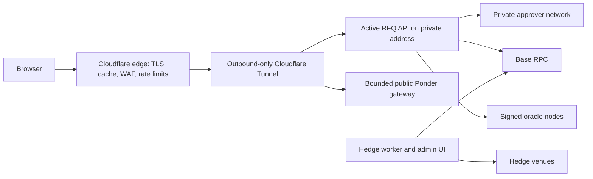

# Edge and origin privacy

The browser should use one public origin:

- `/` serves the React application;
- `/api/*` routes to the active stateless API leader;
- `/stream/*` routes to the API's Server-Sent Events market stream;
- `/index/*` routes only to bounded public Ponder query handlers.

Cloudflare Tunnel is the preferred public ingress. `cloudflared` creates outbound-only encrypted connections from the API network to Cloudflare, so the origin needs no publicly routable address and direct inbound traffic can be denied. Cloudflare documents that this removes the public origin IP and prevents bypass traffic from reaching the service directly. The DNS record must never previously expose the origin address; historical DNS and unrelated services on the same address can otherwise reveal it.

The tunnel does not connect to approver ports, the hedge worker, its SQLite journal, node administration RPC, SSH, metrics with sensitive labels, or the private operations dashboard. Approvers accept only mutually authenticated traffic from pre-enrolled active and standby API identities. The admin dashboard uses a distinct private hostname behind Cloudflare Access or a private network and device policy; it never shares cookies, CORS policy, or routing with the public trading domain.

The edge may cache immutable frontend assets and public finalized indexer responses for short periods. It must not cache quotes, account risk, typed-data payloads, order placement/cancellation, deposits, withdrawals, sessions, or transaction results. Disable response transformation on signed JSON. Preserve request bodies byte-for-byte at the application boundary, set strict body-size limits, and attach a request ID that is excluded from all signed digests.

Use layered abuse controls by endpoint and economic cost:

- broad IP/device rate limits for indicative prices and public reads;
- tighter account plus IP budgets for quote preparation;
- nonce-bound idempotency for signed state-changing calls;
- no challenge page between an already signed order and settlement;
- emergency rules that can stop new risk while leaving cancellation and safe exits reachable.

Cloudflare is an availability and origin-isolation layer, not a protocol authority. A malicious or unavailable edge can censor or alter unsigned indicative data, but it cannot create a valid user signature, two approver signatures, an oracle report, or a clearing-contract state transition. Publish a second static frontend and direct Base interaction instructions for cancellation, session revocation, conservative close, and eligible withdrawals.

The API subscribes to the three oracle nodes' signed batch streams, falls back to REST polling when a stream drops, and keeps the latest combined report in memory. The client receives normalized public price fields over SSE.

Primary reference: [Cloudflare Tunnel security guidance](https://cf-assets.www.cloudflare.com/slt3lc6tev37/7oEleWnoR1ggS7GfMUb3oO/bc05cd36279b0e4bc5fcc942f2a3264e/Cloudflare-security-guide-for-small-and-medium-enterprises.pdf).
