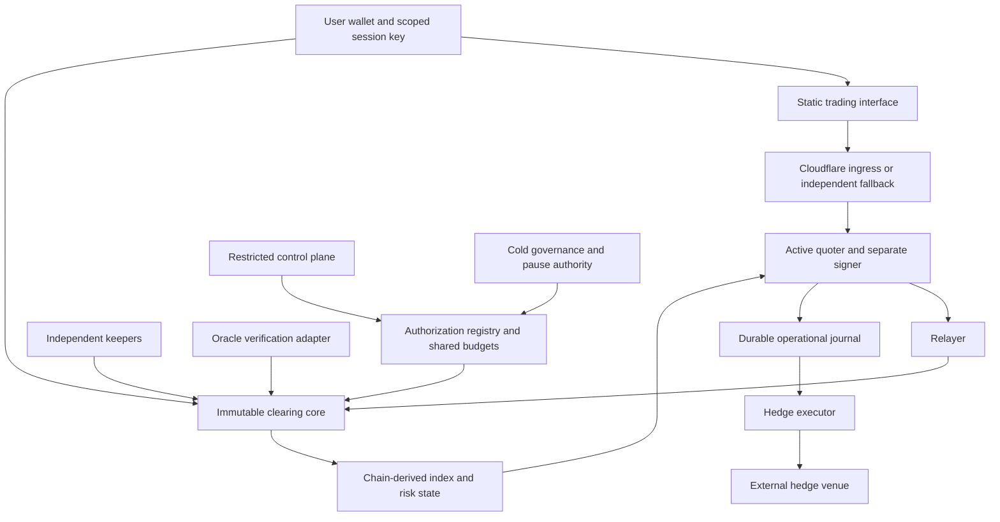

# RFQ Markets — architecture discussion baseline

For the current consolidated proposal, see [2026-09-08-system-design.md](2026-09-08-system-design.md). This file retains the initial review and supporting rationale.

Status: proposal for iteration, not an implementation or security-reviewed specification. The follow-up [authorization and upgrade options](2026-09-08-authorization-and-upgrades.md) supersedes the original preference for full immutability and rotating quoter keys below.
Reviewed: 2026-09-08. Based on the supplied brainstorming notes; later corrections in those notes take precedence over earlier proposals unless challenged below.

## Product direction

An on-chain perpetuals clearing system with an operator-funded market maker, off-chain RFQ pricing, optional external hedging, and independently accessible contract operations. Public developer pseudonymity and reduced origin exposure are explicit objectives. Neither implies anonymity from every infrastructure provider or private on-chain trading.

Proposed initial scope: BTC and ETH, one collateral asset, one-way positions, cross-margin within a subaccount, additive initial/maintenance requirements, no correlation credits, no outside LP deposits. Base and native USDC remain candidates, not finalized decisions. Leverage and capital limits must come from stress tests, not the illustrative numbers in the notes.

Updated user constraints: approximately 1 million USDC of initial maker capital, small initial risk limits, adjustable quoting policy, and no forced user withdrawal/redeposit for ordinary upgrades. Allocation to hedge venues and insurance is undecided; do not assume an additional capital pool. Public promotion of maker capital is optional, but ordinary on-chain balances and accounting are observable.

Keep scoped session keys, signed limit orders and permissionless liquidation. Reconsider full immutability and rotating quoter keys using the follow-up design. Minimize adjustable parameters and enumerate every authority. A mutable oracle address or settlement module can change economic outcomes even if bytecode is immutable. The topology below records the original option, not the newly preferred signing arrangement.

## Trust boundaries

The diagram separates responsibilities, not a mandate for separate contracts or microservices. Start with a small clearing core and libraries, a narrowly defined oracle adapter, and an authorization registry. Avoid seven independently privileged contracts just because the brainstorm listed seven names.

The contracts, oracle, collateral issuer, chain and market-maker solvency are all trust dependencies. Quote availability is operator-dependent. A server-free contract call still needs transaction inclusion, valid oracle data where applicable, and available collateral.

## Corrections that change the design

### Renewable caps are not total compromise limits

`MAX_NOTIONAL` per delegation does not bound a compromised rotator that can repeatedly rotate. A renewer that replenishes a stolen active key's budget also enables repeated loss. Short expiry is not a dead-man switch against an attacker who retains renewal authority.

Use a protocol-wide spending budget that survives rotations, with a bounded burst and refill rate; separately enforce an absolute cumulative allowance per cold-authorized operating period. Hot roles must not reset either counter or extend that period. Explicitly accept the availability cost when the allowance expires. A continuously refilling allowance bounds loss rate, not lifetime loss.

Keep expiry renewal separate from budget replenishment. A pause must latch and prevent hot renewal/rotation until independently authorized recovery. Keep the epoch monotonically increasing across revocation: zeroing the entire registry slot must not reset its replay protection.

The proposed `band × notional cap` estimate is only a simplified price-concession estimate, not a proof of maximum loss. Include both trade legs, oracle selection, funding, fees, rounding, liquidations, market movements and all privileged actions in the actual analysis.

### The market maker needs enforceable solvency rules

Customer deposits do not fund the maker's obligations automatically. Account separately for customer claims, posted maker capital, insurance reserves and operational/hedge treasury. Define maker withdrawal restrictions, reserve requirements for new exposure, conservative asset valuation and the insolvency waterfall.

External hedge equity is not immediately spendable vault collateral. For an initial conservative model, give it no credit toward on-chain withdrawal liquidity. Never give the hedge executor unrestricted access to customer margin.

Unhedged books can also have bad debt. Consider two opposing customers with $100 margin each. A gap produces +$150 PnL for one and -$150 for the other. The winner is owed $250 including collateral; the loser contributes only $100. The vault originally received $200, leaving a $50 shortfall before maker capital. Net market delta can be zero while limited-recourse customer accounts create credit loss.

Funding compensates inventory risk and can encourage offsetting flow; it does not neutralize delta or guarantee new counterparties. Limits must bind against capital, stressed liquidity, concentration and operational capacity together. Annual expected loss is not an adequate insurance sizing model.

### A margin-ratio check does not preserve hedges

With additive maintenance, `equity / maintenance` contains no correlation model. Removing a hedge can improve that ratio while worsening exposure to subsequent prices. At nonpositive equity, ratio-based progress tests can also reject needed liquidation steps.

For v1 use explicit additive margin semantics. Partial liquidation should reduce gross exposure, apply bounded execution penalties, and either restore a target buffer or make formally defined progress. Specify a separate bankruptcy/full-resolution branch. Test liquidation order, fees, zero denominators, rounding and maximum position count. Do not advertise correlation-aware protection from a ratio-only invariant.

### Emergency closing is a pricing product

An unrestricted instant close at a selectable recent oracle price can create an arbitrage route that bypasses the RFQ engine's refusal rights. “Worse than the normal quote” is not a complete execution rule.

Specify user-signed reduce-only exit requests, a deterministic eligible observation rule, user price constraints, bounded close fees/impact, and replay/cancellation behavior. A future-observation request/execute design is worth simulating to reduce retrospective price selection, but adds latency and liquidation interactions. Do not select it without testing.

If no trustworthy oracle observation exists, fair immediate settlement cannot be guaranteed. Define normal, quote-unavailable, oracle-stale/disputed, chain-unavailable and insolvent states separately. Unencumbered balances can remain withdrawable where their availability is provable without stale marks; open cross-margin accounts may need restrictions. A fallback oracle must have predetermined activation and disagreement rules, not be selectable by whichever caller benefits.

### Recoverable servers still need operational state

On-chain balances and positions are authoritative and indexable. Accepted intents, in-flight exposure reservations, transaction replacement history, hedge client IDs, hedge acknowledgements and pricing observations are not all reconstructible from this chain.

Persist an operational journal. If it is lost, halt new risk and reconcile chain and hedge venue before restarting. Give every hedge a stable idempotency identifier where the venue supports one; reconcile before retrying an ambiguous submission. A crashed process is replaceable; its unknown hedge outcome cannot be wished away.

Do not show an off-chain acknowledgement as a settled fill. UI states should distinguish submitted, accepted/pending, included and finalized, with rejection/expiry/reorg handling. An unconditional off-chain fill guarantee would be a separate credit commitment requiring durable records and capital.

### Session keys can lose money without withdrawing

A compromised browser can repeatedly trade away collateral, pay fees, or transfer value economically through an adversarial counterparty. Enforce allowed markets/actions, cumulative turnover, per-order size, fee limits, exposure limits, short expiry and on-chain revocation. A credible loss budget requires precise accounting for realized losses, deposits and unrealized risk; it is not solved by `maxNotional` alone.

Support owner verification compatible with smart-contract wallets as well as EOAs. Deposit/approval/session registration cannot universally be promised as one wallet interaction; this depends on wallet batching and token permissions.

## Settlement and recovery specification to write next

User intent should bind the chain and verifying contract through its signature domain, account/subaccount, market, direction, size, limit price, maximum fee, deadline, nonce, reduce-only flag and partial-fill policy. Account-wide cancellation and session revocation must be enforceable on-chain. Start with all-or-nothing fills to simplify the first prototype.

The maker authorization binds the intent hash, execution size/price/fee, expiry, quote identifier and current epoch. All critical user protections are checked at settlement. Publishing a pricing formula does not prove that an off-chain server followed it or passed through favorable price movements.

Settlement atomically validates signatures, scopes, current authorization, nonces, oracle identity/schema/timestamps, fee and limit bounds, trader margin, maker reserves, OI limits and shared budgets, then updates accounting. Define fixed-point units and conservative rounding explicitly. Checks must hold across all entry points, including emergency exits and liquidations where applicable.

On failover: stop the old leader where possible; reconcile the candidate's inventory and pending operations; rotate on-chain; observe the rotation under the chosen confirmation policy; then enable new signing. Epoch fencing rejects obsolete quotes on the canonical chain but does not eliminate reorg handling, pending exposure or hedge duplication. User intents should not bind the maker epoch.

Accrue funding with signed fixed-point arithmetic and cumulative indices, including the maker's opposite position. Accrue the previous interval before changing skew. Define zero OI, caps, maximum elapsed time, rounding and stale-oracle behavior. Store sufficient aggregate market accounting to check maker liabilities without iterating all users.

## Privacy and infrastructure

Distinguish public developer identity, origin discovery, provider access to memory, traffic metadata, and public wallet linkage. For each, name the observer and desired protection. No-ID signup reduces collected identity data; it does not establish absence of logs or knowledge of the operator.

Cloudflare Tunnel uses outbound connections and removes the need for public application ingress. The host still has network connectivity and egress identifiers, and Cloudflare remains on the traffic path. DNS history, node peer traffic, monitoring, deployments and direct oracle/hedge requests are separate exposure surfaces. See [Cloudflare Tunnel documentation](https://developers.cloudflare.com/tunnel/).

Keep control-plane authorization separate from frontend deployment authority. Separate accounts reduce some credential coupling but do not remove a common provider failure. A Cloudflare Worker/Durable Object is a candidate coordinator only after its authority is genuinely bounded. A Durable Object's single active instance is useful, but durable transaction records, nonce reconciliation and retry logic remain necessary; [in-memory state can be lost on eviction](https://developers.cloudflare.com/durable-objects/reference/in-memory-state/).

Proposed production topology: active/warm quoter across two independently operated providers; independently running keepers; separate control-plane authority; rebuildable index storage plus backed-up operational records; independent frontend/exit access and oracle-data delivery. A fallback that shares the same DNS, CDN and identity account is not independent.

Avoid collecting unnecessary user IP/address associations in analytics. Keep operational logs narrowly scoped with explicit retention. Reproducible releases and artifact hashes aid verification; an IPFS mirror alone does not protect someone using a compromised primary frontend. Verify deployed addresses, wallet permissions and release provenance independently.

Native USDC is an operationally simple candidate, but issuer blocklisting remains a dependency regardless of server location. See [Circle's USDC terms](https://www.circle.com/legal/usdc-terms). Base provides multiple confirmation stages, not immediate final settlement; see [Base transaction finality](https://docs.base.org/specifications/transactions/transaction-finality). Neither choice supplies private transactions.

## Initial hosting screen

This is a limited primary-source screen, not a completed procurement ranking or verification of jurisdictional legal protection. No providers were contacted or purchased. Provider statements below are not independently audited guarantees.

| Candidate | Current evidence | Next check |
| --- | --- | --- |
| VPSBG | Advertises Bulgarian residency, no ID/phone verification and SEV-SNP support on its [site](https://www.vpsbg.eu/). | Best technical candidate to investigate first: validate attestation, image integrity, key binding, service terms and latency. Its [confidential-computing page](https://www.vpsbg.eu/confidential-computing) labels SEV-SNP experimental. |
| 1984 | Advertises Icelandic VPS hosting and Bitcoin/Monero payments on its [site](https://1984.hosting/). | Verify signup requirements, retention, recovery process, service eligibility and actual performance. Crypto payment alone does not establish no-KYC. |
| Servers.guru | Advertises email-only crypto signup and multiple hosting locations on its [site](https://servers.guru/). | Check legal entity, upstream infrastructure independence, retention, terms and provisioning automation. |
| FlokiNET | Primary homepage retrieval failed during this review. | Retain as unverified; obtain primary policy and infrastructure evidence before ranking. |
| Akash | Describes itself as a [decentralized compute marketplace](https://akash.network/). | Evaluate separately from VPS vendors: deployment/lease visibility, underlying provider trust, state recovery and availability. Decentralized procurement does not itself imply private hosting. |

Remaining supplied candidates are retained for a subsequent screen: Caasify, Spacecore, Cloudzy, RedSwitches, Coin.host, Hiddence, Strike, PrivateAlps, Bacloud, VSYS, Shinjiru, Packetra, UnderHost and ExtraVM. No reliability, legal or privacy verdict is made on them here.

Compare contractual entity, physical location, upstream network, identity collection, payment processor, logging/retention, account recovery, acceptable-use terms, confidential-compute support, restoration time and measured tail latency. Different brands can share an upstream failure domain. Privacy-friendly hosting terms do not determine the product's obligations; those require a separate jurisdiction-specific assessment once operator and target-user locations are known.

## Oracle and tool choices

Chainlink remains a candidate. Its [v3 schema](https://docs.chain.link/data-streams/reference/report-schema-v3) includes feed identity, observation validity timestamps and expiry. Report authenticity and cryptographic expiry are not substitutes for a protocol-specific maximum price age. Test timestamp selection and inter-market observation skew adversarially. Liquidity-weighted fields are pricing inputs, not guaranteed executable hedge prices.

Pyth also remains a candidate, but the prior notes' assumption of unrestricted Hermes access is outdated: its [current getting-started documentation](https://docs.pyth.network/price-feeds/core/getting-started) states that Hermes requires an API key following the August 26, 2026 upgrade. Verify production retrieval, redistribution and independent exit-data access for either oracle; API authentication alone is not proof of legal-identity verification.

Suggested prototype tools: Solidity with [Foundry](https://www.getfoundry.sh/) for contracts and invariant/fuzz testing; TypeScript with [viem](https://viem.sh/) for client and relayer; PostgreSQL for operational records and chain-derived views; optionally [Ponder](https://ponder.sh/) for indexed application queries. Keep live execution risk on explicitly reconciled state rather than an unqualified indexer snapshot. Use fixed-point integers for money. Rust can be introduced for a measured performance need, rather than expanding the initial language surface.

Use a small container/system-service deployment with pinned releases. No Kubernetes or additional consensus cluster is required for the initial design. Build a separate deterministic accounting simulator before live quoting; use recorded/synthetic market paths before committing capital to calibration trades.

## First milestone and open decisions

First deliverable: an executable balance-sheet and liquidation model plus a written permission matrix. Follow with a local end-to-end contract prototype and failure injection. Hosting benchmarks can proceed separately, but production capital must wait for economic and contract review.

Acceptance scenarios: balanced-book customer bankruptcy; directional maker loss; stale/disagreeing oracle; stolen quoter plus honest renewal; stolen rotator repeatedly replacing keys; budget exhaustion; pause/recovery; session-key abuse; simultaneous withdrawal and fill; duplicate/reordered settlement; cross-margin liquidation at zero/negative equity; leader failure after hedge acknowledgement; chain rollback; total database loss; unavailable hedge venue; unavailable primary frontend.

Before implementation, settle: allocation of the approximately 1 million USDC maker capital, including insurance and hedge margin; acceptable loss during a defined compromise interval; desired leverage and trade sizes; guaranteed exit semantics; whether independent oracle-data access is mandatory; acceptable disclosure to service providers; and who can exercise independent pause/recovery authority. Compare authorization and upgrade choices before defining contract interfaces.

Historical exploit narratives, exact gas costs, latency guarantees and provider security claims in the brainstorm are not adopted as verified facts. Market choice reduces some risks but does not prove immunity to manipulation or make a sole-maker model categorically safer than alternatives.
