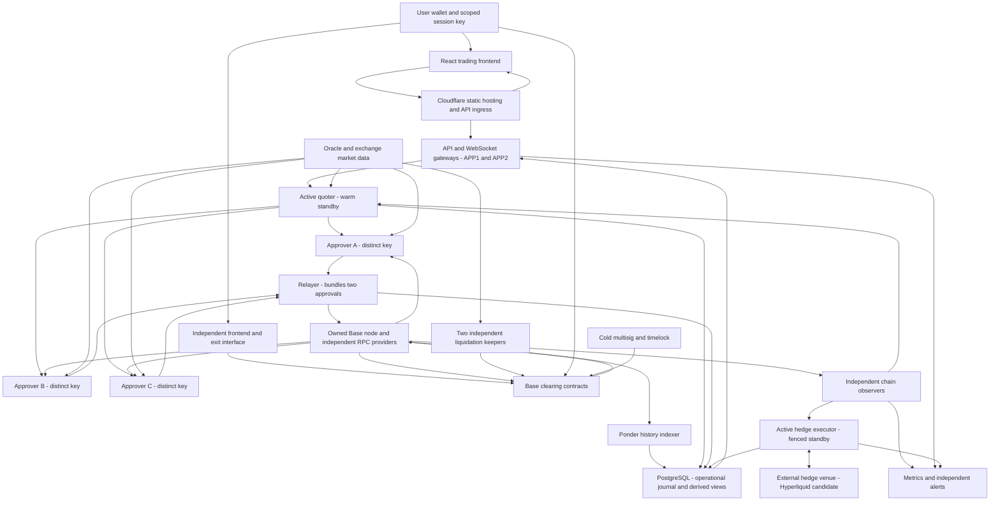
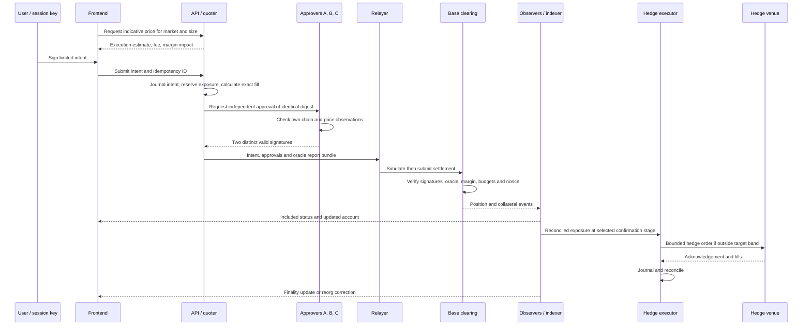

# RFQ Markets — complete reference architecture

Design revision: 2026-09-08. Status: proposed architecture, not deployed infrastructure or an audited implementation.

The subsequent [simplified design](2026-09-08-simplified-design.md) is the current proposal and supersedes this file's separate coordinator/quoter/relayer deployment, duplicated application data and API-held gas credentials. This file retains financial-contract and failure-model detail as supporting background. RFQ-PROTOCOL-RESEARCH.md retains the supporting comparison with existing protocols.

## 1. Product and decisions

Confirmed requirements: approximately 1 million USDC starting maker capital; small initial risk limits; adjustable quoting; developer privacy and reduced server exposure; ordinary upgrades without users withdrawing/redepositing.

Proposed baseline: BTC and ETH perpetuals on Base; native Base USDC collateral; one net position per market per subaccount; cross-margin within each subaccount; additive margin requirements without correlation credits; an operator-funded maker; unsigned quoters; two-of-three independent execution approvals. Start without outside LP deposits, equity markets or protocol-owned cross-chain collateral.

Base, oracle vendor, providers, signer threshold and precise governance policy are recommendations for this design, not finalized procurements. No contracts, domains, wallets or servers have been created. Numerical risk parameters remain subject to economic simulation and security review.

## 2. System topology

Arrows show application/data flow, not necessarily the direction in which TCP connections are initiated. Approvers can initiate persistent outbound authenticated channels to receive proposed fills.

The RPC and market-data boxes represent multiple connections. They must not become one shared gateway that all approvers blindly trust. Approval results return through the coordinator to the relayer; approvers do not broadcast settlement transactions themselves.

## 3. Technology choices

| Layer | Proposed technology | Purpose |
| --- | --- | --- |
| User interface | React, TypeScript, Vite | Static trading application with no mandatory server-side rendering |
| Wallet integration | wagmi and viem | Wallet connection, typed signatures, contract reads and direct transactions |
| API | Node.js supported LTS, TypeScript, Fastify; HTTPS and WebSockets | Requests, quote updates, account projections and execution status |
| Quoter | Separate TypeScript process; BigInt fixed-point money arithmetic | Pricing, inventory skew, size limits and exposure reservations |
| Approvers | Small isolated TypeScript services with vetted signature libraries | Independently validate and sign exact execution terms |
| Relayer | TypeScript and viem | Simulation, gas sponsorship, submission, receipt/replacement tracking |
| Contracts | Solidity, OpenZeppelin components, Foundry | Clearing, signatures, accounting, liquidation, upgrade checks |
| Database | PostgreSQL | Durable execution/hedge journal and separate derived application tables |
| Indexer | Ponder | Reorg-aware event indexing for history and queries |
| Execution observers | Direct RPC log/block subscriptions plus reconciliation reads | Risk state independent of application-indexing lag |
| Base node | Current official Base node distribution, Reth-based execution | Local chain verification and RPC access |
| Oracle | Chainlink Data Streams candidate, EVM verifier integration | Contract-verifiable external prices |
| Hedging | Venue REST/WebSocket adapters; Hyperliquid first candidate | Separate capital account and bounded hedge execution |
| Deployment | Pinned Linux images, containers and systemd; Ansible-style configuration | Repeatable, small-server operations |
| Monitoring | Prometheus, Grafana and Alertmanager, plus external health checks | Economic and infrastructure health |
| Private transport | Mutually authenticated TLS; WireGuard where useful | Component identity and encrypted service traffic |

This intentionally starts with one application language. Native code or Rust can be introduced where profiling or isolation requirements justify it. Approval implementations remain small; merely rewriting identical logic in another language is not a security proof.

Framework capabilities are documented by [React](https://react.dev/), [Vite](https://vite.dev/guide/), [Fastify](https://fastify.dev/), [wagmi](https://wagmi.sh/react/getting-started) and [Ponder](https://ponder.sh/docs/get-started). Pin and review actual dependency versions when implementation begins. No production throughput or latency is implied by these selections.

## 4. Blockchains and assets

Base mainnet is the proposed settlement chain; Base Sepolia is the test environment; local Foundry/Anvil simulations precede either. Ethereum is an underlying Base dependency, not a second application deployment. Gas submitters hold ETH on Base.

USDC is the only initial collateral token. Validate the canonical token address and decimals against issuer documentation at deployment. No generic token deposits, arbitrary collateral wrappers or internal bridging in v1. Wallet funding from another chain is a separate operation, outside RFQ settlement.

If markets display USD oracle prices but PnL is denominated in USDC, explicitly convert with an approved USDC/USD observation and define a depeg halt policy. Do not silently assume 1 USDC equals 1 USD under all conditions. Required feed availability and exact accounting units are launch prerequisites.

Hyperliquid, if selected, is an external hedging environment. Customer positions remain on Base. Hedge-venue funds are maker funds with their own custody, availability and transfer risks. Moving capital between environments is treasury management, not an atomic part of a customer fill. See the venue's [API documentation](https://hyperliquid.gitbook.io/hyperliquid-docs/for-developers/api).

## 5. Frontend and ingress

Serve a static build through [Cloudflare Workers Static Assets](https://developers.cloudflare.com/workers/static-assets/). Publish a reproducible release bundle and an independently hosted mirror/exit page; optionally pin the same bundle to IPFS. Do not require Cloudflare to use the direct contract interface.

The UI displays size-specific execution price, explicit fee, combined cost, margin effect, funding and order status. Price and PnL estimates identify their observation time. Session keys authorize narrow trading actions; owner-wallet confirmation is required for withdrawals and delegation changes. Browser compromise can still cause trading losses, so scope, turnover, fee and exposure limits apply.

Use HTTPS for account/history requests and intents, WebSockets for quotes/status, and JSON-RPC through a selectable provider for direct contract operations. Quote updates are indicative until an exact fill obtains valid approvals. Show submitted, pending, included, finalized, rejected/expired and reorged states honestly. Stops and other conditional orders are a later feature unless their trigger semantics are enforced explicitly.

Cloudflare Tunnel connects APP1/APP2 to normal public ingress. A separate gateway hosts fallback access without Cloudflare. Its public address is deliberately exposed; approvers and database ports are not. Request/body limits, schema validation and quote-rate limits protect resource use. Read-only pages and direct exit access should not depend on a login database.

## 6. API, quoter and relayer

The API is an access and presentation layer. It cannot create balances or authorize trades. It validates formats, routes requests, serves chain-derived views and returns complete approved execution bundles so the user can submit one independently when valid.

Run one active quoter and a warm standby initially. This simplifies pricing and pending exposure management; the quoter has no maker approval key. Its inputs are reconciled positions, pending reservations, verified price observations, exchange liquidity, volatility, hedge status and configured policy. It proposes the exact amount, execution price, fee and deadline.

The pricing policy adjusts quote center for inventory, width for execution costs/volatility, and size for capacity. It can refuse requests. Funding, signed price limits and financial accounting are enforced elsewhere. Off-chain configuration can tighten operating limits immediately, but cannot override contract ceilings.

The coordinator requests all three approvals concurrently. Two valid distinct approvals over the same digest complete the bundle. A rejection from one approver is diagnostic, not an automatic global veto; every eligible pair must independently enforce the full policy. Severe disagreement alerts an operator and may trigger an independently defined pause.

Relayers simulate and submit bundles using separate low-balance ETH keys. Multiple relayers may operate with distinct transaction-sender accounts; protocol nonces prevent double execution. Track transaction replacement and uncertain inclusion durably. A relayer can censor or waste its gas balance, but cannot alter approved terms.

## 7. Approval services

Deploy A, B and C on separate providers, each with its own private key. Every service has independent chain observation and oracle retrieval. It must not trust balances, timestamps or prices merely because the API/quoter supplied them.

Each checks the complete user intent, exact proposed terms, own market reference, approved report identity/age, local exposure/reservations and configured constraints. Each signs the same EIP-712 digest binding chain, clearing address, protocol version, signer-set version, intent hash, market, quantity, price, fee, quote ID and expiry. The relayer cannot mix signatures from different proposals.

On-chain checks reject duplicate recovered addresses, invalid signatures, unauthorized keys, wrong versions and consumed nonces. A stolen A key used on two machines is still A. One bad approver cannot force a trade rejected by B and C; two bad approvers compromise maker authorization. Shared code/data/deployment attacks remain common failure risks.

Stable signer keys avoid hourly renewal machinery. A signer host stores its own encrypted key with separately controlled recovery material; after a full reboot, v1 permits manual unsealing of that one signer while the other two serve traffic. Do not claim an encrypted file plus locally stored decryption secret protects against a hostile host. Cold replacement/revocation is available if recovery is uncertain. Avoid coordinated reboots and global automatic updates.

Signer-set changes increment a version and do not reset exposure or execution budgets. Pause/removal can be immediate; additions require stronger delayed authority. Removing A leaves B+C required; the threshold never silently falls to one. No online provisioning service can install arbitrary new signers.

Two-of-three is authorization, not distributed consensus. Both A+B and B+C may approve requests consuming the same remaining capacity. Current-state contract checks decide which fills can execute. Off-chain approvals are never authority to overwrite on-chain balances.

## 8. Contracts and governance

Use one principal upgradeable clearing system with internal libraries for most functionality. A stable proxy holds state and funds. Avoid a proliferation of separately upgradeable contracts. Logical components below need not all be deployments.

| Logical component | State and responsibility |
| --- | --- |
| Collateral ledger | Customer balances, maker capital, insurance accounting and permitted withdrawals |
| Position/funding engine | Net positions, entry accounting, aggregate liabilities, cumulative funding indices |
| Settlement | User intent, maker approvals, replay protection and atomic position changes |
| Authorization | Three approver addresses, two-signature threshold, signer-set version, scoped sessions |
| Risk | Initial/maintenance margin, gross/net exposure, fee and execution-budget constraints |
| Oracle adapter | Approved feeds/verifier, units, maximum age and observation consistency |
| Liquidation/exit | Permissionless resolution and separately specified fallback closing rules |
| Governance | Cold multisig, timelock, limited pause/risk-tightening roles |

Recommended governance starting point is a cold multisig with independently secured devices and a timelock for upgrades, oracle changes, signer additions and risk expansion. A 48–72 hour delay is a discussion range, not a settled value. Distinct devices held by one person improve key separation but do not create independent governance.

Compatible proxy upgrades preserve balances and positions at the same address. They must test storage layout, live accounting, funding and signature-version semantics. No unrestricted emergency-upgrade bypass. A pause role can stop new risk but cannot transfer collateral or deploy replacement logic. Upgrades can ultimately change core rules: this is an explicit trust assumption, not immutable fund protection. See [OpenZeppelin proxy documentation](https://docs.openzeppelin.com/upgrades-plugins/proxies).

Example settlement order: verify domain/intent/session; verify two maker identities and signed terms; validate required oracle observations; accrue funding under previous state; enforce user limit/fee/nonce; calculate post-trade trader and maker accounting; enforce margin, reserves and shared budgets; commit balances/positions/nonces/events atomically. External interactions follow reentrancy-safe ordering. All monetary calculations use explicitly defined signed fixed-point units and conservative rounding.

Do not sum token balances and call that maker equity. Reserve accounting must distinguish positive customer claims, unpaid funding, maker posted capital, bankrupt-account deficits and insurance. Customer withdrawals must leave their account sufficiently collateralized; maker withdrawals must preserve required backing and withdrawal liquidity. Hedged capital outside Base receives no automatic on-chain solvency credit in the initial model.

Funding is a bounded on-chain function with lazy cumulative accrual and the maker as economic counterparty. Settle the elapsed interval before skew changes. User-to-user redistribution excluding the maker is not the proposed model.

## 9. Oracle, live state and indexers

Use Chainlink Data Streams as the current integration candidate. Retrieve authenticated reports independently on approval/keeper hosts; submit reports for contract verification. Verify feed identity, schema, conversion units, observation time, expiry and permitted inter-market time skew. The [report schema](https://docs.chain.link/data-streams/reference/report-schema-v3) provides relevant timestamps; a report's validity period is not our maximum safe price age.

Independent exchange data informs pricing and detects divergence. It cannot silently replace the contractual oracle. If feeds disagree or are stale, block affected new risk and apply the predetermined exit/valuation policy. A secondary oracle is not automatically interchangeable; adding one needs defined activation and disagreement rules. Independent user/keeper access to usable reports is a production prerequisite, including applicable access and redistribution terms.

Two data tracks serve different purposes:

- Live observers track block hashes, logs and position state for quoting, approvals, hedging and liquidation. They reconcile against contract reads and roll back on reorgs.
- Ponder indexes history and account projections for API queries. Indexer lag cannot authorize fills or postpone keeper work.

Approvers use their own observers with different primary RPC paths. Compare block hashes and periodically cross-check sources; do not accept a provider's reported balance without reconciliation. All services record the block/observation version of their snapshots.

Use an owned Base node plus at least two independent production RPC services. Vendor selection remains pending privacy and performance review. An owned node still needs Ethereum execution/beacon data and peer connectivity; it is not a replacement for Base's sequencer or an anonymity service. The current [Base node guide](https://docs.base.org/specifications/node-operators/run-a-node) specifies the operator distribution and L1 dependencies.

## 10. Operational storage and hedging

PostgreSQL holds separate operational and derived schemas. Operational records include signed intents, approval bundles, reservations, transaction hashes/replacements, hedge intent IDs, venue acknowledgements, balances and reconciliation checkpoints. Derived tables include deposits, fills, funding history, positions and liquidation history. No approver key is stored in this database.

Use a primary and cross-provider replica, encrypted backups and restoration drills. DATA2's independent indexer writes to a separate local PostgreSQL instance, not to the read-only operational replica. Indexer writers have no access to the operational journal. Start with supervised failover rather than an unreviewed automatic two-node election. Asynchronous replication can lose recent operational records; after failover, halt new risk until chain and hedge venue reconciliation resolves missing outcomes. Rebuilding the index alone is insufficient.

A dedicated hedge executor follows settled exposure plus explicitly budgeted pending risk. It trades toward a target inventory band. Initially, hedge after the chosen inclusion stage and manage the remaining reorg risk; do not automatically hedge every signed proposal. If early hedging is added later, model failed settlements explicitly.

Only one hedge executor may write at a time. A standby uses separate venue credentials and stays inactive. Before takeover, fence the old writer using verified shutdown or venue-side credential revocation; reconcile orders/fills and client IDs. A database lease alone cannot stop a partitioned old host from sending venue orders. If fencing is uncertain, suspend new hedge orders and shrink/stop RFQ risk.

Use trade-only venue credentials where supported; master withdrawal authority remains cold. A trade-only key can still lose posted hedge capital through bad trades, so hedge margin and venue permissions are capped. Funding/top-ups are explicit treasury operations. [Hyperliquid's API-wallet documentation](https://hyperliquid.gitbook.io/hyperliquid-docs/for-developers/api/nonces-and-api-wallets) is an implementation reference, with exact permissions to be tested before use.

The approximately 1 million USDC is the planning total. The split between Base maker capital, insurance, hedge margin and treasury reserve is still open. None is double-counted. Profitable expected flow is not used as collateral for current liabilities.

## 11. Liquidations, exits and degraded modes

Run two keepers on separate data hosts. Each independently observes account health and obtains valid oracle reports. Anyone else can perform the same contract-defined liquidation. Bounties and maximum work per call must make the path economically usable; permissionless code alone does not ensure third parties participate.

Use additive maintenance and partial liquidation with explicit progress/target rules; nonpositive-equity accounts take a separate bankruptcy branch. A margin ratio alone does not measure correlation risk. Penalties, resolution order and loss waterfall are part of the contract specification.

Proposed emergency close is request/execute: the user signs or submits reduce-only intent with a price bound, a deterministic eligible later observation prices execution, and a bounded fee/impact rule applies. This needs economic simulation before final adoption. Cancellation, expiry, concurrent liquidation and partially closing a cross account must be specified. Do not offer arbitrary instant historical-oracle execution.

| Failure | Expected behavior |
| --- | --- |
| One approver unavailable | Remaining two can approve; alert and recover failed service |
| One approver compromised | Revoke/version it; remaining two required; review outstanding approvals |
| Fewer than two approvers available | No ordinary RFQ fills; direct liquidation/exits use separate rules |
| Active app/quoter fails | Standby resumes after state/reservation reconciliation; signer keys unchanged |
| Database primary fails | Stop new risk, fence/promote/reconcile; direct contract paths and keepers remain independent |
| Hedge venue or writer fails | Cap/reduce new exposure; never assume missing hedge acknowledgement means no fill |
| One indexer fails | History may lag; independent observers and keepers continue |
| Cloudflare fails | Independent gateway/mirror and direct submission available |
| Oracle stale/disputed | No affected new risk; restrict valuation-dependent operations per explicit policy |
| Base inclusion unavailable | No immediate on-chain execution guarantee; queue/reject clearly |
| Maker insolvency | Enter predetermined resolution; never pay arbitrary first-come withdrawals from shared shortfall |

Insolvency resolution, oracle-outage valuation and emergency-exit pricing are unresolved economic specifications, not implementation details. They must be completed before real funds; the infrastructure diagram does not prove those mechanisms safe.

## 12. Proposed server placement

This is a concrete deployment plan for costing and testing. Providers/locations are candidates, not existing servers, reserved capacity or verified legal protection. Cities are omitted where exact facilities have not been verified.

| Host | Proposed provider / country | Services | Initial sizing hypothesis |
| --- | --- | --- | --- |
| APP1 | VPSBG / Bulgaria | Primary gateway, active quoter, coordinator, relayer | 4–8 vCPU, 8–16 GB RAM |
| APP2 | Servers.guru / Netherlands | Secondary gateway, warm quoter, second relayer | 4–8 vCPU, 8–16 GB RAM |
| SIGN1 | VPSBG / Bulgaria, separate VM/account controls | Approver A only | 2–4 vCPU, 4–8 GB RAM |
| SIGN2 | Servers.guru / Netherlands, separate VM/account controls | Approver B only | 2–4 vCPU, 4–8 GB RAM |
| SIGN3 | 1984 / Iceland | Approver C only | 2–4 vCPU, 4–8 GB RAM |
| DATA1 | VPSBG / Bulgaria | Primary PostgreSQL, indexer, keeper 1 | 4–8 vCPU, 16–32 GB RAM, NVMe |
| DATA2 | Servers.guru / Netherlands | Replica, independent indexer, keeper 2, monitoring | 4–8 vCPU, 16–32 GB RAM, NVMe |
| HEDGE1 | VPSBG / Bulgaria, separate VM | Active hedge executor | 2–4 vCPU, 4–8 GB RAM |
| HEDGE2 | Servers.guru / Netherlands, separate VM | Inactive hedge standby | 2–4 vCPU, 4–8 GB RAM |
| FALLBACK1 | 1984 / Iceland, separate from SIGN3 | Static mirror/exit page and restricted reverse proxy to APP1/APP2 | 2 vCPU, 2–4 GB RAM |
| NODE1 | VPSBG / Bulgaria, large VDS or dedicated hardware pending capacity check | Owned Base node only | 8+ cores, 64 GB RAM target, local NVMe sized from current chain/snapshot data |
| Edge | Cloudflare / global network | Static frontend, primary ingress, rate limiting | Managed service; no approval/governance keys |
| Governance | Offline devices in separately secured locations | Upgrade and treasury authority | No hosted root key |

This is eleven server instances plus managed edge services. Several processes share a data/app host; signing and hedge execution have deliberate separation. A development environment can use local containers, but cannot claim these production fault boundaries. A smaller deployment can omit NODE1 initially in favor of production RPCs, accepting that dependency. Do not collapse distinct approver keys into one provider account merely to reduce instance count.

Provider evidence: [VPSBG](https://www.vpsbg.eu/) advertises Bulgarian hosting and minimal identity collection; [1984](https://1984.hosting/) advertises Icelandic VPS; [Servers.guru](https://servers.guru/) lists Netherlands hosting and email-only crypto signup. These are provider claims. Verify terms, account recovery, retention, upstream ownership and available hardware before purchase. [VPSBG's confidential computing](https://www.vpsbg.eu/confidential-computing) is worth testing for SIGN1, but is labeled experimental and must not substitute for quorum isolation.

The small-VM sizes are estimates to benchmark, not vendor guarantees. For NODE1, use [Base's sizing guidance](https://docs.base.org/specifications/node-operators/performance-tuning): modern multi-core CPU, recommended 64 GB memory and storage based on current chain size plus snapshot/restoration headroom. Do not reuse the brainstorm's static 2–4 TB assumption without measuring current requirements. Exact monthly pricing is intentionally not estimated from entry-level landing-page prices.

One provider outage can remove an approver plus app/data/hedge services. Two approval signatures may remain available while database/hedge recovery still pauses trading. This topology limits single-provider key compromise and supports recovery; it does not promise uninterrupted RFQ service under every provider outage.

## 13. Network and privacy controls

Public surfaces: frontend, normal API edge, independent fallback gateway and the blockchain itself. Private surfaces: approvers, database, internal RPC and admin/monitoring endpoints. APP1/APP2 dial out through Cloudflare Tunnel; FALLBACK1 connects over authenticated private transport. Approvers dial out to redundant request endpoints and independently to market-data/RPC sources.

Use distinct service identities and least-privilege database/API roles. The request endpoint cannot register signer keys. No shared unrestricted deploy token across SIGN1/SIGN2/SIGN3. Updates to approvers are staged and independently authorized; all three may still share a latent code bug, which requires testing and review rather than more replicas.

Tunnel ingress concealment is not traffic anonymity. Hosting providers see their VMs, oracle/hedge endpoints see connection metadata, and Cloudflare handles normal frontend/API traffic. P2P node networking is especially observable, so NODE1 is separate from signers. An independent fallback gateway deliberately reveals its own address without exposing signer ingress.

Keep user analytics minimal; avoid unnecessary wallet/IP joins and full payload logging. Operational records still need enough information to reconcile trades and incidents. Define retention and encryption rather than making an unsupported no-logs claim. On-chain trades, maker balances and governance addresses remain observable; USDC issuer and Base dependencies remain unchanged by server geography.

## 14. Trade sequence

Initial deposit/session setup and withdrawals are owner-authorized contract operations. Keeper liquidation and fallback exits do not take the quoter/approver route. Actual elapsed times require benchmarks across the proposed countries and external endpoints.

## 15. Operations and implementation sequence

Alert on approval quorum, oracle age/disagreement, block lag, database replication, pending settlement age, gas balances, hedge mismatch, available collateral, liquidation backlog, budget exhaustion and unusual markouts. An HTTP health check alone is insufficient. Place independent availability alerts outside the primary provider and Cloudflare account. Monitoring must not gain upgrade authority.

Deploy signed, digest-pinned artifacts; keep backups separate from live credentials; test restore and staged restart. Infrastructure automation provisions machines but cannot silently grant settlement authority. No Kubernetes, Kafka, custom MPC or new chain consensus is required for this baseline.

Implementation order: finalize accounting/exit/insolvency rules and capital allocation; model them under adversarial paths; implement local contracts and signature tests; connect one quoter and three approvers; add live observers, journal, relayers and hedge simulator; build the UI and independent exit interface; run testnet fault injection; review/audit before bounded real-capital deployment.

Launch gates include duplicate-signature rejection, stale/replayed approvals, simultaneous oversubscription, revoked sessions, one hostile approver, one unavailable approver, database record loss, old hedge writer fencing, oracle outage, reorg, bankrupt cross account, USDC depeg behavior and compatible upgrades with live positions. Availability and loss bounds are measured outcomes of those tests, not assumed properties of the diagram.
