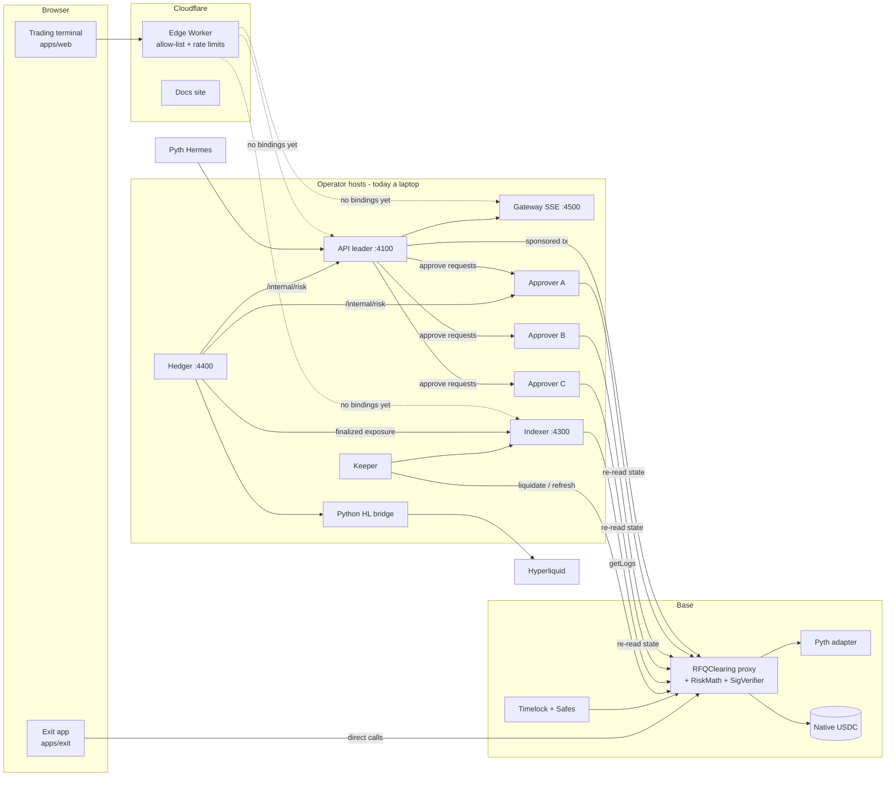

# 1. Product and architecture

Audit date: 2026-10-06, repository HEAD `bae3332` (last commit 2026-09-20).
Detailed evidence with `file:line` references lives in [`reviews/`](reviews/).

## What RFQ Markets is

RFQ Markets is a leveraged **perpetual-futures venue for BTC and ETH** that settles on **Base**, with **native USDC** as the only collateral.

- There is no order book. A trader asks for a price for an exact size and gets one all-or-nothing price.
- **The operator is the only market maker.** Every trade is against the operator's own capital ("maker backing"), which sits inside the clearing contract next to an insurance fund. There are no third-party makers, no LP deposits and no token.
- Prices come from **Pyth** (signed bid/ask derived from price ± confidence), plus an adaptive spread, an inventory charge that cannot be dodged by splitting orders, and a 2 bps fee.
- Every fill needs **three signatures**: the trader's EIP-712 intent (or a scoped session key), and **2 of 3 independent operator "approvers"**. The contract re-checks everything that matters (price limit, fee cap, oracle freshness, margin, exposure caps, stress loss, capital floor), so a compromised operator server cannot fill outside those bounds.
- **Gas is sponsored.** Traders sign; the operator's sender wallet submits.
- The maker's net exposure is **hedged on Hyperliquid** by an off-chain worker.
- Planned capital (economic spec v0.1): about $1M split into 600k maker backing, 150k insurance, 200k hedge margin, 50k operations.

Comparable products the original design cites: Variational, Hashflow, 0x RFQ, SYMMIO.

## Users and roles

| Role | Who | What they do |
| --- | --- | --- |
| Trader | Public | Deposit USDC, trade BTC/ETH perps with market or resting limit orders, close (25/50/75/100% on PR #5), withdraw, optional popup-free "quick trading" session key. |
| Market maker | Operator | Funds maker backing and insurance, runs the off-chain stack, hedges on Hyperliquid. |
| Approvers A/B/C | Operator, ideally on 3 providers | Each independently re-checks a quote and co-signs it. 2 of 3 required. |
| Keeper | Anyone (operator runs one) | Liquidations, oracle refresh, resolution steps. Earns a bounded reward. |
| Governance | 72h timelock owned by a Safe | Upgrades, approver rotation, oracle change, loosening limits, unpausing. |
| Emergency council | Separate Safe | Pause, advance leader epoch, tighten or disable markets. Cannot unpause, upgrade or move funds. |

## Products and surfaces

| # | Product | Code | Audience | Status |
| --- | --- | --- | --- | --- |
| 1 | **Clearing contracts** (`RFQClearing` behind a transparent proxy, `RFQRiskMath` and `RFQSignatureVerifier` linked libraries, Pyth and Chainlink oracle adapters, testnet timelock) | `contracts/` | On-chain | On Base Sepolia (two stacks). Not on mainnet. |
| 2 | **Trading terminal** (trade ticket, chart, positions, orders, history, deposit/withdraw, quick trading, public Markets dashboard) | `apps/web` | Traders | Live on Cloudflare but cannot trade: no backend is connected. |
| 3 | **Public docs** (Overview, Trading, Margin, Security, Transparency) | `apps/docs` | Public | Live on Cloudflare. |
| 4 | **Direct exit app** (withdraw, cancel nonce, revoke session, paused close, resolution claim, with no API) | `apps/exit` | Traders when the operator is down | Built in CI, not hosted anywhere. |
| 5 | **Hedge ops dashboard** (customer vs venue exposure, hedge orders) | `apps/admin` | Operators | Local only. Needs Cloudflare Access first. |
| 6 | **Internal manual** (renders ~31 repo markdown docs) | `apps/internal-docs` | Operators | Local only. Needs Cloudflare Access first. |
| 7 | **Design-system specimen** | `apps/design-system`, `packages/design-system/tokens.css` | Designers | Local only. |
| 8 | **API leader** (quotes, intents, approval collection, sponsored submission, limit-order book, account reads, market stream source) | `services/api` | Backend | Runs on a developer machine only. |
| 9 | **Approver** ×3 | `services/approver` | Backend | Developer machine only. |
| 10 | **Market stream gateway** (secret-free SSE fan-out) | `services/gateway` | Backend | Developer machine only. |
| 11 | **Indexer** (SQLite read model of clearing events) | `services/indexer` | Backend | Developer machine only. |
| 12 | **Keeper** (liquidation, oracle refresh, resolution) | `services/keeper` | Backend | Host profile only; not started by the local or testnet stacks. |
| 13 | **Hedger** (Hyperliquid via a Python SDK bridge) | `services/hedger` | Backend | Developer machine; pinned to Hyperliquid testnet. |
| 14 | **Cloudflare edge Worker** (route allow-list, rate limits, fail-closed 503s) | `deploy/cloudflare/static` | Edge | Live in front of the terminal. |
| 15 | **Persistent host packaging** (systemd unit per role, runtime identity attestation, journal snapshot/restore) | `deploy/host`, `Dockerfile.host`, `scripts/persistent-service.ts` | Ops | Built; never provisioned. |
| 16 | **Qualification and release tooling** (canaries, soak, release-evidence gate, mainnet plan generator, supply-chain evidence, topology validator, alert checker) | `scripts/` | Ops | Built; 72h soak never completed. |
| 17 | **Research simulator and market-flow calibration lab** | `simulator/` (Python, stdlib only) | Research | Runs in CI (50 tests). Nothing calibrated from real data yet. |

## Feature list

Trading
- Market orders by RFQ: amount + Buy/Sell, automatic price protection (limit and fee cap), 30-second intent.
- Resting limit orders (all-or-none, 5 minutes to 30 days), triggered by the API when the oracle crosses.
- Reduce-only closes (full close on `main`; 25/50/75/100% on draft PR #5).
- Quick trading: browser-generated session key with on-chain scope (markets, per-trade and cumulative notional, fee cap, expiry ≤ 30 days; UI default 8h, $2,500/trade, $10,000 total).
- Emergency owner close at the oracle price while the venue is paused.

Account and funds
- Native USDC deposit (approve + deposit, trader pays gas). Contract also supports sponsored EIP-3009 `depositWithAuthorization`, not wired in the UI.
- Sponsored signed withdrawals, nonce cancellation and session revocation; direct-call fallbacks in the exit app.
- Cross margin across BTC and ETH. Tiered margin from 20% IM / 12% MM (~5x) up to 100% / 60% at $5M.

Risk and solvency
- On-chain inventory-impact floor, per-trade and per-market caps, gross and per-side caps, stress-loss ≤ 25% of maker backing, capital floor.
- Off-chain pending-exposure reservations (four-corner envelope) at the API and every approver, journaled before any signature leaves.
- Continuous skew-based funding capped at ±100% APR.
- Partial liquidation toward 22% equity, 50 bps penalty, keeper reward; portfolio bankruptcy netting.
- Loss waterfall: collateral → penalty → insurance → maker backing → global pro-rata resolution (no auto-deleveraging).
- Hedge-health gating: normal / guarded (half size) / reduce-only.

Operations
- Leader epoch, signer-set and policy versions fence stale approvals.
- Durable sender: signed transactions journaled before broadcast; replacement fee bumps; ambiguity detection.
- Startup attestation of deployed code and roles across two RPCs.
- Alerts definition, incident runbook, journal snapshot/restore, approver recovery import.
- Signed, scanned, SBOM-attested host image workflow.

## System map (as built)

Logical boundaries that hold up well: the contract is the only ledger; the API has no fund authority; approvers each hold one key and re-validate; the gateway holds no secrets; keepers are permissionless.

## Codebase at a glance

| Area | Size | Notes |
| --- | --- | --- |
| Contracts | ~2.3k lines, 131 KB | Clearing 605 lines; dense, partly minified Solidity to fit a 21,000-byte self-imposed gate (20,995 used). |
| Services | ~2.9k lines, 357 KB | `services/api/src/server.ts` is 544 lines but 93 KB; one line is 3,013 characters. |
| Scripts | ~3.1k lines, 373 KB | ~95 files, 70+ npm scripts. |
| Apps | ~0.9k lines, 123 KB | `TradePage.tsx` holds ~25 `useState` hooks in one component. |
| Simulator | ~1.7k lines Python | stdlib only. |
| Docs | 36 top-level markdown files, ~440 KB | Overlapping, several stale. |

The project was built in about 12 days (commits 2026-09-09 → 2026-09-20, one author, design docs dated 2026-09-08). 589 source lines exceed 300 characters. There is no formatter or linter. Tests are strong for the hard parts (quorum, sender crash recovery, gross reservations, 13,500 Solidity-vs-JS risk comparisons, 600-step stateful run) and the full `npm test` gate passes.

Read next: [deployment inventory](02-deployment-inventory.md), [flowcharts](06-flowcharts.md).
