# 6. Flowcharts: products and flows

All diagrams describe the code as it is on `main` (`bae3332`). GitHub renders them directly.

## 6.1 Product map

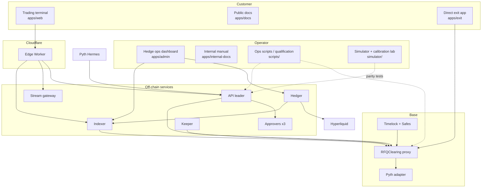

## 6.2 Market order (RFQ) end to end

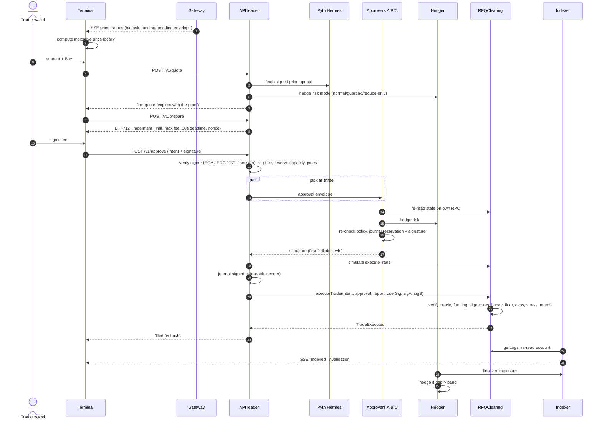

## 6.3 Contract checks inside `executeTrade`

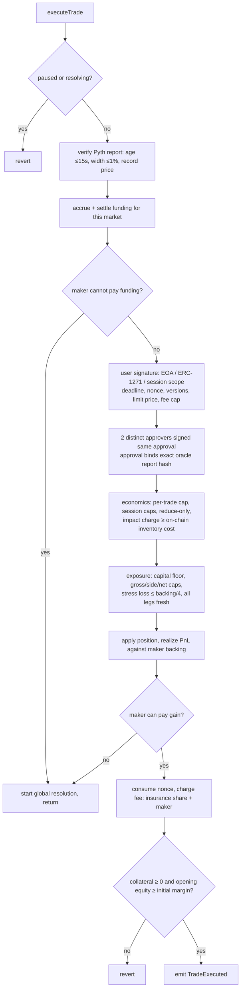

## 6.4 Resting limit order

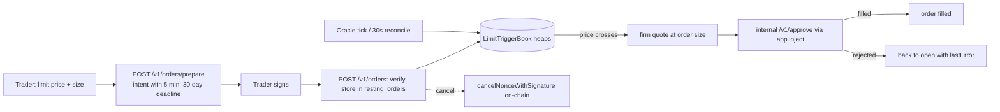

## 6.5 Deposits, withdrawals and exits

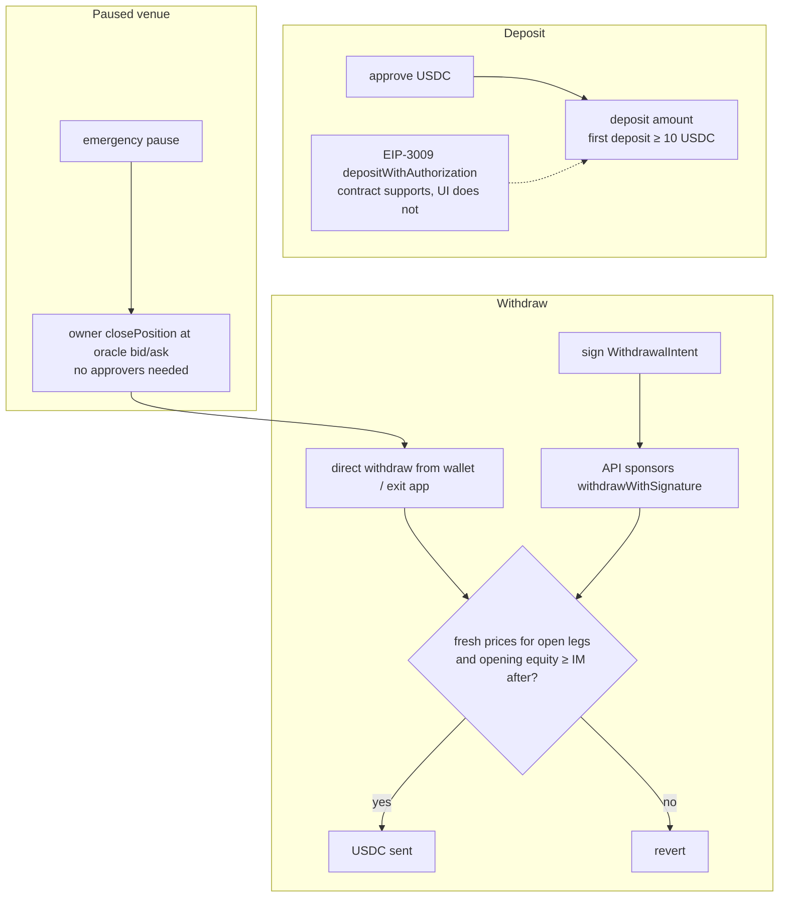

## 6.6 Liquidation and loss waterfall

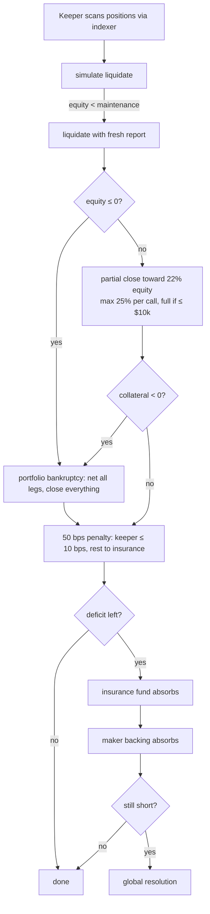

## 6.7 Global resolution

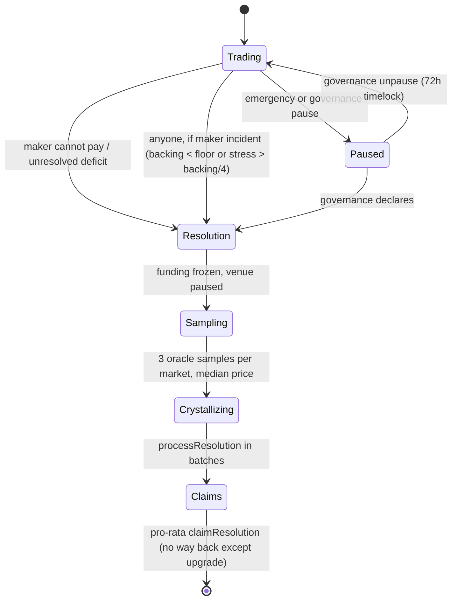

## 6.8 Hedging loop

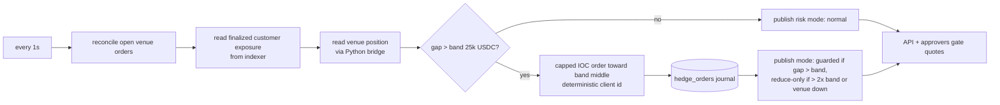

## 6.9 Governance and emergency powers

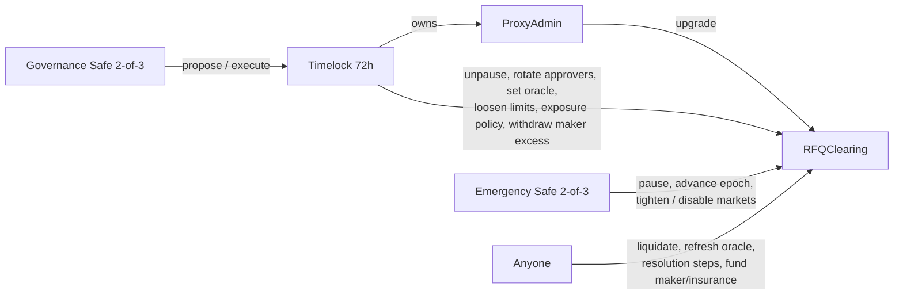

## 6.10 Delivery pipeline

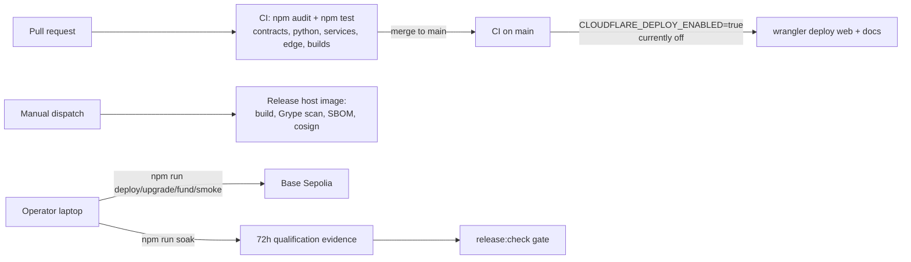

## 6.11 Target topology for the capped mainnet canary

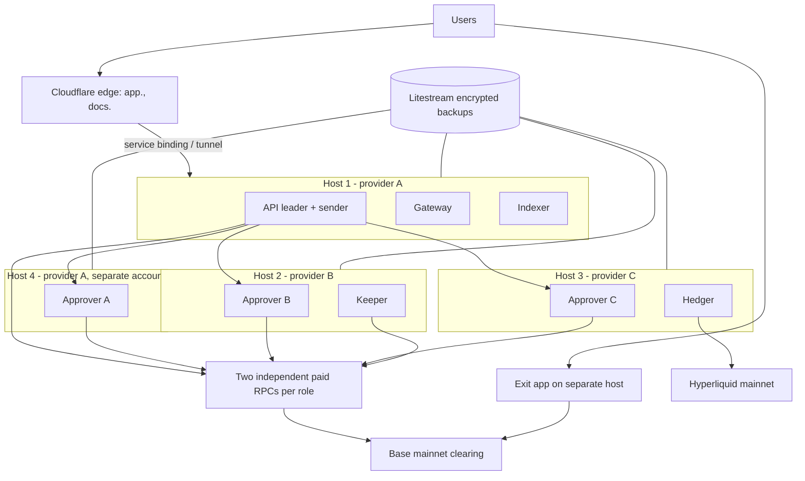
