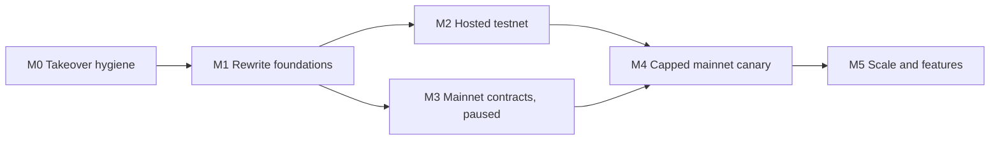

# 7. Roadmap to production

Four milestones, then feature-by-feature work. Each milestone ends in something you can see: a merged PR, a live URL, or a mainnet address. Nothing here moves real money until milestone M4.

## M0: Takeover hygiene (small PRs, days)

| Item | Why |
| --- | --- |
| Merge Dependabot #6 (vite), #7 (react), #8 (mocha); close #9 (solc) and #10 (zod 4) with a note | Green, low-risk bumps now; the other two belong inside the rewrite. |
| Decide PR #5: harvest partial closes, realized PnL history and the exit UI into the new layout, then close it | It conflicts with `main` and predates the restructure. |
| Record the rapid-iteration implementation `0x2128C4C8…b676` and back up `.local-state/` from the original machine | The only copy of testnet identities and manifests. |
| Renew or remove the expired vulnerability waiver (expired 2026-09-30) | The release-image workflow now fails closed. |
| Scope the Cloudflare token to the deploy steps and require a push event from this repo | Hardening of `deploy-cloudflare.yml`. |
| Frontend safety fixes: no `/v1/dev/wallet` call in production, SSE reconnect after HTTP errors, docs "Open app" link, drop the admin bundle token option | Visible bugs on the live sites. |
| Add `AGENTS.md`/`CLAUDE.md` pointers to this pack | So every future session starts from the current map. |

## M1: Rewrite foundations (the bulk of the work)

Order and detail are in [05-refactor-and-rewrite-plan.md](05-refactor-and-rewrite-plan.md). Each line is one or more PRs.

1. Format the codebase (Biome, ruff); pnpm workspaces + Turborepo; delete dead code.
2. **Contracts v1 in Foundry**: modular, readable, ERC-7201 storage, market mapping, paused initialization with caps, the medium findings fixed, invariant + fork tests, Slither.
3. `@rfq/protocol` + `economics.json`; remove cross-language drift.
4. `@rfq/chain` on viem; split the API; fix the sender; logging; inter-service schemas; zod 4.
5. New `apps/trade` on wagmi/viem + TanStack; exit app on viem with Pyth proof fetching; Starlight docs.
6. One ops CLI replacing ~70 npm scripts.
7. Consolidated docs (eight files + archive).

Exit criterion: `pnpm test` green, contract invariants and fork tests green, a full local stack (including keeper) passes the open → hedge → close journey from the new terminal.

## M2: Hosted testnet

| Item | Detail |
| --- | --- |
| Fresh Base Sepolia deployment of contracts v1 | Governed stack with real separate Safe owners (your hardware wallet plus two others). |
| Three hosts on at least two providers | API + gateway + indexer; approvers split across hosts; keeper and hedger separate. systemd units already exist. |
| Private transport API → approvers | WireGuard/Tailscale or Cloudflare Tunnel; approvers never public. |
| Edge wiring | Cloudflare Tunnel or origin with authenticated pulls, service routes enabled, custom domain (`app.` / `docs.`), Cloudflare Access for ops and internal docs. |
| Paid RPCs | Two independent providers per role (e.g. Alchemy + QuickNode/dRPC). |
| Backups and alerts | Litestream to object storage; pino logs; alerts from `deploy/operations/alerts.json` paging a phone. |
| Exit app hosted off Cloudflare | IPFS or GitHub Pages with a published build hash. |
| Wallet matrix | MetaMask, Rabby, Coinbase Smart Wallet, WalletConnect mobile, a Safe (ERC-1271). |
| 72h qualification | With fixed retry policy and retry/latency evidence recorded. |

Exit criterion: anyone can trade on `app.<domain>` against Base Sepolia for 72 hours with zero worse-than-limit fills, < 0.5% operational rejections and p95 approval-to-inclusion inside budget.

## M3: Base mainnet contracts, paused

Contract deployment on Base costs a few dollars of gas; the real cost is that a deployed storage layout is permanent. So:

- **Now (parallel with M1):** deploy the mainnet governance layer: governance Safe, emergency Safe, timelock. These addresses survive any contract rewrite. Owners on hardware wallets.
- **After contracts v1 passes M1 tests and a Sepolia rehearsal:** deploy the clearing stack to mainnet **paused**, with launch caps set in `initialize`, sources verified on Basescan and Sourcify, ProxyAdmin owned by the timelock. No maker capital yet.

What a mainnet deploy needs from you: a deployer wallet with ~0.01–0.05 ETH on Base, the Safe owner addresses (hardware wallets), the governance threshold (spec says 3-of-5, testnet used 2-of-3), the timelock delay (72h recommended), the Pyth Base mainnet contract (verify `0x8250f4aF4B972684F7b336503E2D6dFeDeB1487a` against Pyth's docs) and the canary caps. The "Base mainnet deploy prep" thread is building this tooling.

## M4: Capped mainnet canary

| Gate | Detail |
| --- | --- |
| Independent reviews | Solidity audit (contracts v1 only, ~1–2k lines), plus an economic review of pricing, funding and resolution. |
| Capital | Small maker backing and insurance first (for example $25k / $5k), raised only after observation. |
| Caps | Per-trade, per-market, gross, side and daily-loss limits set conservatively; one or two markets. |
| Hedging | Hyperliquid mainnet agent wallet with its own capital; or run unhedged at tiny caps for the first window (decide then). |
| Operations | Incident runbook rehearsed; pause and unpause rehearsed through the real timelock; journal restore rehearsed on a clean host. |
| Publish | Addresses, source, parameters, timelock delay, powers and the operator-trust statement. |

## M5: Scale and features

More markets (enabled by the market mapping), Postgres read model, active/standby API with fenced promotion, partial fills, take-profit/stop-loss, isolated margin, sponsored EIP-3009 deposits, embedded wallets, cross-chain deposits, third-party makers.

## Feature-by-feature plan

Each row is a unit we can go through together: understand, improve, upgrade, ship.

| # | Feature | Today | Improve / upgrade | Production gate |
| --- | --- | --- | --- | --- |
| 1 | RFQ market orders | Works end to end on testnet; API is one 93 KB closure | Split into quoting + execution modules; viem multicall; stable error codes; explicit order states in the UI | Zero worse-than-limit fills over the soak |
| 2 | Pricing (spread, inventory impact, fee) | Hand-set constants copied 4–7 times | `economics.json` single source; Solidity↔TS↔Python parity test; approvers rebuild volatility/toxicity inputs or the trust split is documented | Economic review sign-off |
| 3 | 2-of-3 approvals | Strong design; same RPC for all in qualification | Per-approver RPCs and hosts; per-rule unit tests; quote-model version enforced in production | Three providers, hardware-backed or HSM keys |
| 4 | Limit orders | Works; executes via `app.inject` through the public rate limiter | Direct execution service; separate internal budget; better cancel accounting | Soak with resting orders |
| 5 | Closes (full / partial) | Full on `main`, partial on PR #5 | Port partial closes; reduce-only judged against maintenance margin | Contract test for IM–MM band |
| 6 | Quick trading sessions | Works; key lost on reload; session overwrite griefing in contract | Contract fix; WebCrypto non-extractable key; clear reload UX | Wallet matrix |
| 7 | Deposits | Approve + deposit, trader pays gas | Sponsored EIP-3009 deposit in the UI; real USDC fork test | Real-USDC fork test |
| 8 | Withdrawals | Sponsored signed + direct | Oracle-outage path documented; batched refresh + withdraw | Outage drill |
| 9 | Exit app | Built, not hosted; user pastes proofs | viem, automatic Pyth proofs, separate host, reproducible build | Hosted off Cloudflare with published hash |
| 10 | Margin and liquidation | Works; keeper not in local/testnet stacks | Monotonic oracle; keeper in all stacks with margin pre-filter | Liquidation drill on testnet |
| 11 | Funding | Skew ÷ market limit; retroactive on limit change | Decide scale vs spec; accrue before limit change | Economic review |
| 12 | Insurance and loss waterfall | Works | Events for funding of buckets; dashboard | Bankruptcy drill |
| 13 | Global resolution | Griefable, irreversible, surplus locked | Grace/threshold, bounded sampling, surplus sweep | Resolution drill end to end |
| 14 | Governance and emergency | Testnet Safes from one key file; no governed-upgrade script | Real owners; timelock op tooling; decide emergency unpause | Pause/unpause rehearsed on mainnet |
| 15 | Oracle | Pyth works; Chainlink untested | Record Pyth as primary; outage policy; drop or fork-test Chainlink | 72h with zero stale-proof reverts |
| 16 | Hedging | Testnet only, Python bridge, trusts indexer | Chain-read exposure; TS adapter; mainnet profile; aggregate loss budget | Venue fencing drill |
| 17 | Indexer and history | Custom SQLite, rebuild on reorg | Ponder/Postgres or reorg walk-back; realized PnL (from PR #5) | Reorg drill |
| 18 | Market stream | Works | Shared SSE helper; client reconnect | Edge load test |
| 19 | Trading UI | Single component, raw wallet | Rebuild on wagmi/viem + TanStack + Radix | Playwright + axe green |
| 20 | Public docs | React SPA, broken app link | Starlight | — |
| 21 | Ops dashboard and internal manual | Local only | Starlight internal build + ops app behind Access | Access policy verified deny-by-default |
| 22 | Sponsored gas | Daily in-process budgets | Separate keeper/API wallets, refill alerting | Sponsor depletion drill |
| 23 | Durable sender | Correct; O(history) reconcile; serial | Prune reconcile; reorg state; nonce lanes later | Kill-at-every-boundary drill |
| 24 | Hosting and edge | Laptop + workers.dev | Hosts, tunnel, domains, Access, backups, alerts | M2 exit criterion |
| 25 | Qualification and release tooling | Complete, inconsistent retries, no evidence | One retry classifier, file evidence, rejection-rate gate | 72h evidence attached to release |
| 26 | Simulator and calibration | Drifted float models; no real data | Prune; Solidity differential; real flow capture on a host | Calibration report before raising caps |

## Open decisions for you

1. Mainnet sequencing: governance now and clearing after the contract rewrite (recommended), or deploy the current contracts paused now.
2. Governance threshold for mainnet: 2-of-3 or 3-of-5, and who holds the keys.
3. Hosting providers for the three hosts.
4. Canary capital and caps.
5. Hedge the canary from day one, or run unhedged at tiny caps first.
6. Indexer: re-evaluate Ponder, or keep the custom one.
